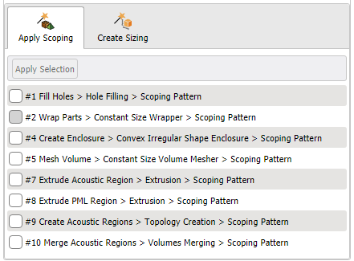

##  Apply Scoping

Allows you to scope the parts, zones or labels for scoping patterns and size field for size field name patterns in the **Domain Browser**

**Apply Scoping** has the following options:
* **Apply Selection**: Allows you to select the parts, zones, labels or size fields from **Domain Browser** for the scoping pattern. **Apply Selection** is available only when you select parts, zones, labels or size fields in the **Domain Browser**.
 To scope entities in **Domain Browser**, select the entities in Domain **Browser**, select the check box below the **Apply Selection** for the corresponding scoping patterns, and then click **Apply Selection** to scope the entities to the selected patterns.
