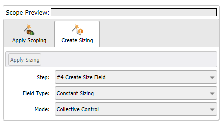

## Create Sizing

Allows you to create size field controls for the existing **Create Size Field** operations for the mesh workflow model. **Create Sizing** is available only when a **Create Size Field** operation is available in the **Mesh Workflow**.

**Create Sizing** has the following options:

* **Apply Sizing**: Allows you to select the parts, zones or labels for the size field. **Apply Sizing** is available only when you select parts, zones or labels in the **Domain Browser**.
* **Step**: Displays the available Create Size Field steps in the mesh workflow.
* **Field Type**: Allows you to select the control type for the **Create Size Field** operation. The available control types are:
    * **Constant Sizing**: Allows you to set the maximum size on the selected scope based on the other applied size controls on the scope.
    * **Curvature Sizing**: Allows you to refine the surface mesh to capture the underlying curve and surface curvature.
    * **Proximity Sizing**: Allows you to compute edge and face sizes in gaps using the specified minimum number of element layers.
    * **Body of Influence Sizing**: Allows you to apply mesh sizing based on the specified element.

* **Mode**: Allows you to select the mode of creating size field for the mesh workflow. The available options are:
    * **Collective Control**: Creates the single size field control type for the selected parts, zones or labels.
    * **Individual Control**: Creates the separate size field control type for selected parts, zones or labels. The format for naming a single control is <part name> (<control type>)
