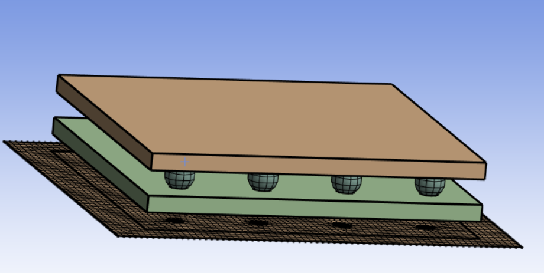

### Stacker: Volume Flattening

**Stacker: Volume Flattening** project the 3D bodies onto the base face (2D) along the defined axis and create the labels for the base face and edges.

**Stacker: Volume Flattening Details** view has the following options:

**General**

* **[Control Type](../controls.md)**: Displays the selected control type.

**Scope**

* **[Define By](../controls.md)**: Allows you to define the input to the selected control.
The available options are **Value** and **Outcome**.

  * **Value**: Allows you to set manually the value of the **Scoping Method** and **Scoping Pattern**.

  * **Outcome**: Allows you to select the existing scoped outcomes from the previous steps as input.

* **[Scoping Method](../controls.md)**: Allows you to select the entities for the selected control.
The available options are:

  * **Part**: Allows you to select parts for defining the scope of the control.

  * **Label**: Allows you to select labels for defining the scope of the control.

  * **Zone**: Allows you to select zones for defining the scope of the control.

* **[Scoping Pattern](../controls.md)**: Allows you to specify the name pattern to get the selected **Scoping Method**.
 **Scoping Pattern** supports **Regular Expression** . You can click  on the right corner of the option and the following options are available:
    * **Publish**: Publishes **Scoping Pattern** to the **Property Worksheet**. 
    * **Scope All**: Inserts '.*' regular expression to scope all entities.

**Definition**

* **Origin X**: Allows you to specify the X coordinate to project the coordinates and create the base face. You can click  on the right corner of the option and click **Publish** to publish **Origin X** to the **Property Worksheet**. You can parametrize **Origin X**.
* **Origin Y**: Allows you to specify the Y coordinate to project the coordinates and create the base face. You can click  on the right corner of the option and click **Publish** to publish **Origin Y** to the **Property Worksheet**. You can parametrize **Origin Y**.
* **Origin Z**: Allows you to specify the Z coordinate to project the coordinates and create the base face. You can click  on the right corner of the option and click **Publish** to publish **Origin Z** to the **Property Worksheet**. You can parametrize **Origin Z**.
* **Direction X**: Allows you to specify the stacking direction along the X axis on which topology is projected to create the base face. You can click  on the right corner of the option and click **Publish** to publish **Direction X** to the **Property Worksheet**. You can parametrize **Direction X**.
* **Direction Y**: Allows you to specify the stacking direction along the Y axis on which topology is projected to create the base face. You can click  on the right corner of the option and click **Publish** to publish **Direction Y** to the **Property Worksheet**. You can parametrize **Direction Y**.
* **Direction Z**: Allows you to specify the stacking direction along the Z axis on which topology is projected to create the base face. You can click  on the right corner of the option and click **Publish** to publish **Direction Z** to the **Property Worksheet**. You can parametrize **Direction Z**.
* **Lateral Defeature Tolerance**: Allows you to set the tolerance for repairing or defeaturing the edges of the base face. You can click  on the right corner of the option and click **Publish** to publish **Lateral Defeature Tolerance** to the **Property Worksheet**. You can parametrize **Lateral Defeature Tolerance**.

**Seed Face Scope**
* **[Define By](../controls.md)**: Allows you to define the input to the selected control.
The available options are **Value** and **Outcome**.

  * **Value**: Allows you to set manually the value of the **Scoping Method** and **Scoping Pattern**.

  * **Outcome**: Allows you to select the existing scoped outcomes from the previous steps as input.

* **Seed Face Scoping Method**: Allows you to scope the faces outside the input scope whose edges and mesh (if present) are to be transferred to the base face and  respected while meshing.
The available options are:

  * **Label**: Allows you to select labels for defining the seed face scope of the **Stacker: Volume Flattening** control.

  * **Zone**: Allows you to select zones for defining the scope of the **Stacker: Volume Flattening** control.

* **Seed Face Scoping Pattern**: Allows you to specify the name pattern to get the selected **Seed Face Scoping Method**.
 **Seed Face Scoping Pattern** supports **Regular Expression**. You can click  on the right corner of the option and the following options are available:
    * **Publish**: Publishes **Seed Face Scoping Pattern** to the **Property Worksheet**.
    * **Scope All**: Inserts '.*' regular expression to scope all entities.