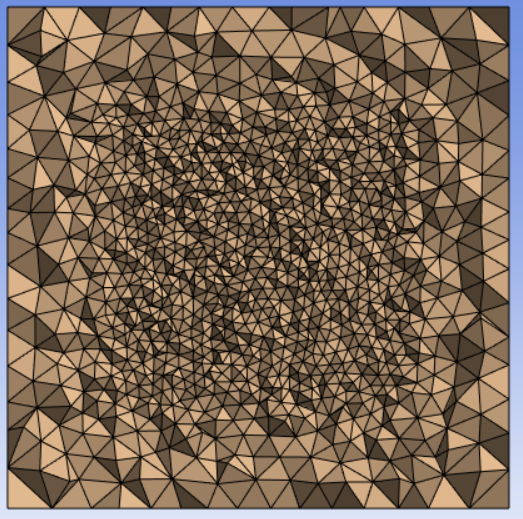

# Body of Influence Sizing

**Body of Influence Sizing** control allows you to apply mesh sizing based on the specified element 
size and controls the mesh density based on neighboring bodies of influence.

**Body of Influence Sizing Details** view has the following options:

**General**

* **[Control Type](../controls.md)**: Displays the selected control type.

**Scope**

* **[Scoping Method](../controls.md)**: Allows you to select the entities for the selected control.
The available options are:

  * **Part**: Allows you to select Parts for defining the scope of the control.

  * **Label**: Allows you to select Labels for defining the scope of the control.

  * **Zone**: Allows you to select Zones for defining the scope of the control.

   
* **[Scoping Pattern](../controls.md)**: Allows you to specify the name pattern to get the selected **Scoping Method**.
 **Scoping Pattern** supports **Regular Expression**.

**Definition**
* **Define By**: Allows you to scope the operation based on your selection.
 The available options are:
   - **Value**: Allows you to define the maximum size based on the provided element size.
   - **Settings**: Allows you to define the maximum size based on the defined acoustic settings.
*	**Element Size**: Allows you to provide the element size for the selected scope. 
  You can click  on the right corner of the
  option and click **Publish** to publish **Element Size** to the **Property Worksheet**.

* **Growth Rate**: Allows you to specify the increase in element edge length 
  with each succeeding layer of elements. The default value is **1.2**.
