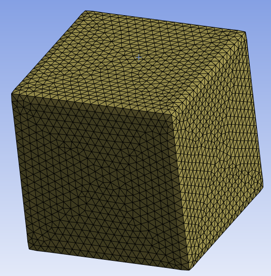

# Constant Size Surface Mesher

**Constant Size Surface Mesher** control creates a surface mesh on the scoped set of
entities consisting of triangular or quadrilateral mesh elements of same size.

**Constant Size Surface Mesher Details** view has the following options:

**General**

* **[Control Type](../controls.md)**: Allows you to select the control type.

**Scope**

* **[Define By](../controls.md)**: Allows you to define the input to the selected control.
The available options are **Value** and **Outcome**.

  * **Value**: Allows you to set manually the value of the **Scoping Method** and **Scoping Pattern**.

  * **Outcome**: Allows you to select the existing scoped outcomes from the previous steps as input.
  
* **[Scoping Method](../controls.md)**: Allows you to select the entities for the selected control.
The available options are:

  * **Part**: Allows you to select Parts for defining the scope of the control.

  * **Label**: Allows you to select Labels for defining the scope of the control.

  * **Zone**: Allows you to select Zones for defining the scope of the control.

* **[Scoping Pattern](../controls.md)**: Allows you to specify the name pattern to get the selected **Scoping Method**.
 **Scoping Pattern** supports **Regular Expression**.

**Definition**

* **Define By**: Allows you to define the element size based on value or settings.
  The available options are:
  * **Value**: Defines the element size based on the provided value.

  * **Settings**: Defines the element size based on the settings under
  **Mesh Settings** in the **Steps Details** view.

* **Element Size**: Provides the element size for surface meshing.

  When **Define By** is **Value**, you can specify the element size for surface meshing. 

  When **Define By** is **Settings**, displays the element size calculated 
  based on the provided **Mesh Settings** in the **Steps Details** view. 
  The **Element Size** is read-only. 

  You can click  on the right corner of the
  option and click **Publish** to publish **Element Size** to the **Property Worksheet**.

  You can parameterize **Element Size** only when **Defined By** is **Value**.

* **Mesh Type**: Allows you to select the type of mesh elements you want to generate.
  The default value is **Triangles**.
  The available options are:
  * **Triangles**: Creates mesh with triangular elements.
  * **Quadrilaterals**: Creates mesh with quadrilateral dominant elements.

* **Project on Geometry**: Allows you to project the created mesh on the underlying geometry when **Project On Geometry** is **Yes**. The default value is **Yes**.

* **Retain Existing Mesh**: Allows you to retain the mesh on the already meshed faces while remeshing when **Retain Existing Mesh** is **Yes**. The default value is **No**.

* **Preserve Boundaries(Beta)**: Allows you to preserve the boundaries when **Preserve Boundaries** is Yes.
* **Skewness Limit**: Allows you to specify the maximum skewness limit for the face elements. 
The default value is **0.9**.