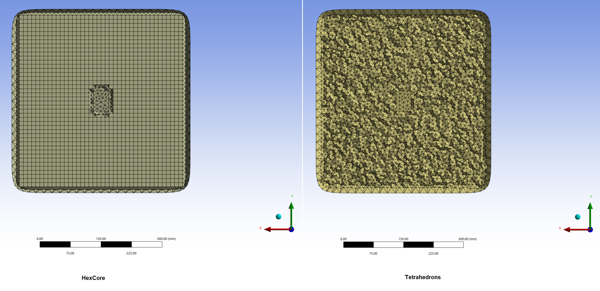

# Constant Size Volume Mesher

**Constant Size Volume Mesher** creates a volume mesh of uniform size on the entire volume.

**Constant Size Volume Mesher Details** view has the following options:

**General**

* **[Control Type](../controls.md)**: Allows you to select the control type.

**Scope**

* **[Define By](../controls.md)**:Allows you to define the input scope of the **Constant Size Volume Mesher** control.

* **[Scoping Method](../controls.md)**: Allows you to scope Part, Label, Zone or Material Point as input for the **Constant Size Volume Mesher** control.

  * **[Scoping Pattern](../controls.md)**: Allows you to specify the name pattern to get the selected **Scoping Method**. **Scoping Pattern** supports **Regular Expression**.

**Definition**

* **Define By**: Allows you to define the element size based on value or settings.
  The available options are:
  * **Value**: Defines the element size based on the provided value.

  * **Settings**: Defines the element size based on the settings under
  **Mesh Settings** in the **Steps Details** view.

* **Element Size**: Provides the element size for volume meshing.
  
  When **Define By** is **Value**, you can specify the element size for volume meshing.  
  When **Define By** is **Settings**, displays the element size calculated 
  based on the provided **Mesh Settings** in the **Steps Details** view. 
  The **Element Size** is read-only.   
  You can click   on the right corner of the option 
  and click **Publish** to publish **Element Size** to the **Property Worksheet**.
  You can parameterize **Element Size** only when **Defined By** is **Value**.
  
* **Label Name**: Allows you to provide the name for the created volume. The name is added to **Labels** tab in the **Domain Browser**.

* **Mesh Type**: Allows you to provide the type of mesh.
The default value is **Tetrahedrons**.
The available options are:
    * **Tetrahedrons**: Creates tetrahedral mesh.
    * **HexCore**: Creates hexcore mesh.
    When you select **HexCore**, **HexCore Relative Tet Layer** allows you to specify the 
    number of tet layer elements created between the boundary and hex cells.
    The default value is **0.25**.

* **Remesh**: Allows you to remesh the entire volume when **Remesh** is **Yes**.
The default is **No**.

* **Refresh Outdated Volumes**: Allows you to delete the outdated volumes and add new volumes 
  when **Refresh Outdated Volumes** is **Yes**. The default value is **No**.

* **Skewness Limit**: Allows you to specify the maximum skewness limit for the face elements. 
The default value is **0.9**.
