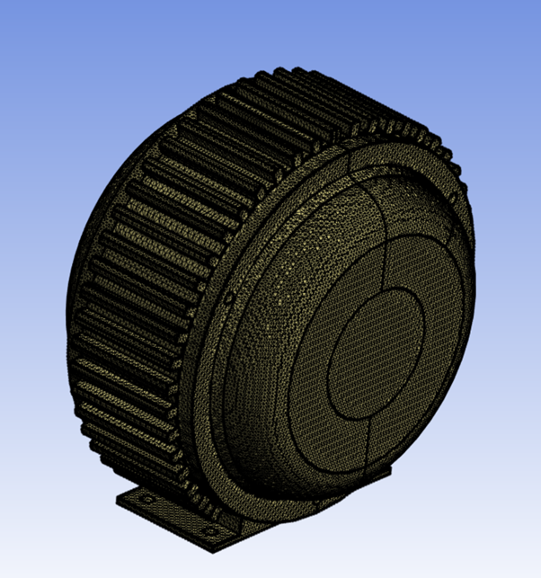

# Constant Size Wrapper

**Constant Size Wrapper** wraps the input scope with the same size throughout the model.

**Constant Size Wrapper Details** view has the following options:

**General**

* **[Control Type](../controls.md)**

**Scope**

* **[Scoping Method](../controls.md)**

    Only **Part** can be selected for Constant Size Wrapping.

* **[Scoping Pattern](../controls.md)**

**Definition**

* **Define By**: Allows you to define the element size based on value or settings.
  The available options are:
  * **Value**: Defines the element size based on the provided value.

  * **Settings**: Defines the element size based on the settings under
  **Mesh Settings** in the **Steps Details** view.

* **Scale Element Size**: Allows you to apply scale factor to element size defined by Settings
when **Scale Element Size** is **Yes**. The default value is **No**.  **Scale Element Size** is
available only when **Define By** is **Settings**.

* **Size Scale Factor**: Allows you to specify the factor to scale the element size defined by Settings.
The default value is 1.0.  **Size Scale Factor** is available only when **Define By** is **Settings**.
You can click   on the right corner of 
  the option and click **Publish** to publish **Size Scale Factor** to the **Property Worksheet**.
  You can parameterize **Size Scale Factor**.
  
* **Element Size**: Provides the minimum feature element size of the input scope to be considered for wrap operation.

  When **Define By** is **Value**, you can specify the element size for wrapping.

  When **Define By** is **Settings**, displays the element size calculated 
  based on the provided **Mesh Settings** in the **Steps Details** view.
  The **Element Size** is read-only. 

  You can click   on the right corner of 
  the option and click **Publish** to publish element size to the **Property Worksheet**.

  You can parameterize **Element Size** only when **Defined By** is **Value**.

* **Mesh Type**: Allows you to select the mesh type.
When **Mesh Type** is **Triangles**, generates triangular mesh.
When **Mesh Type** is **Quadrilaterals**, generates quad mesh.
The default value is **Triangles**. 

* **Live Region Type**: Allows you to select the region type to extract the wrap region.
The available options are:

  * **Material Point**: Allows you to define the volume of the model being wrapped.
  The material point is set locally along the X, Y and Z coordinates.

  * **External**: Allows you to wrap the surface from the external region.
  For **External FEM Acoustics** and **BEM Acoustics** workflows,
  the default value is **External**.

  * **Largest Internal**: Allows you to define the largest internal 
  region of the model as the region for wrapping. 
  For **External FEM Acoustics** and **BEM Acoustics workflows**, 
    the default value is **Largest Internal**.
    
* **Delete Input Scope**: Allows you to delete the input source of the model
after wrapping when **Delete Input Scope** is **Yes**. The default value is **Yes**.

* **Exclude Enclosure**: Allows you to exclude the external region and 
wrap inner parts only for the box in box models when **Exclude Enclosure** is **Yes**.
The default value is **No**.

* **Face Zone By Part**: Creates a face zone for each part of the input scope
when **Face Zone By Part** is **Yes**.
The created face zones are converted to named selections in **Mechanical** 
after completing the mesh workflow. 
When **Face Zone By Part** is **No**, 
creates a single face zone for the whole input scope.
Hence, only a single named selection is available for **Mechanical** 
after completing the mesh workflow.
The default value is **No**.

* **Wrap by Part**: Allows you to perform automatically a separate wrap 
for each part of the input scope when **Wrap by Part** is **Yes**.
The default value is **No**.

* **Reverse Surface Orientation**: Allows you to reverse the orientation 
of the created wrapper surfaces.
The default value is **No**.
When **Reverse Surface Orientation** is **No**, 
the orientation is same as the position of the **Live** material point for the wrapper.
When **Reverse Surface Orientation** is **Yes**, 
the orientation is opposite to the position of the **Live** material point for wrapper.
**BEM Acoustics** uses **Reverse Surface Orientation** where you need to 
wrap the external and solve the internal field.
