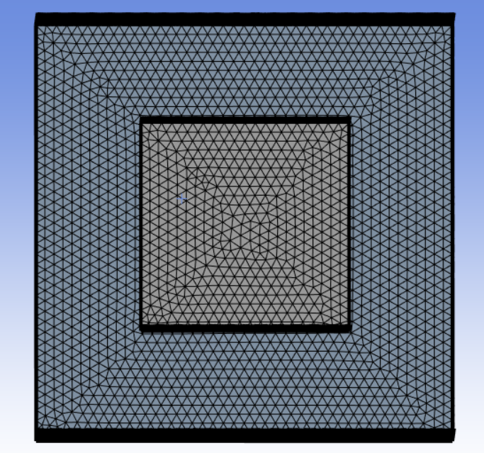

# Constant Sizing

**Constant Sizing** control allows you to set the maximum size on the selected scope based on the other applied size controls on the scope. 
If no size controls are applied on the selected scope, a uniform size is provided throughout the mesh. 
That is, constant sizing is ignored on the selected scope, if the any other applied size controls on the scope specify a smaller size.

**Constant Sizing Details** view has the following options:

**General**
* **[Control Type](../controls.md)**: Displays the selected control type.

**Scope**

* **[Scoping Method](../controls.md)**: Scopes Part, Zone or Label in the model.

* **[Scoping Pattern](../controls.md)**: Scopes the Part, Zone or Label with the provided pattern.

**Definition**
* **Define By**: Allows you to scope the operation based on your selection.
The available options are: 
    - **Value**: Allows you to define the maximum size based on the provided element size.
    - **Settings**: Allows you to define the maximum size based on the defined acoustic settings.
* **Element Size**: Provides the maximum element size for surface meshing.
  You can click  on the right corner of the
  option and click **Publish** to publish **Element Size** to the **Property Worksheet**.
* **Growth Rate**: Allows you to specify the increase in element edge length with each
 succeeding layer of elements. The default value is **1.2**.