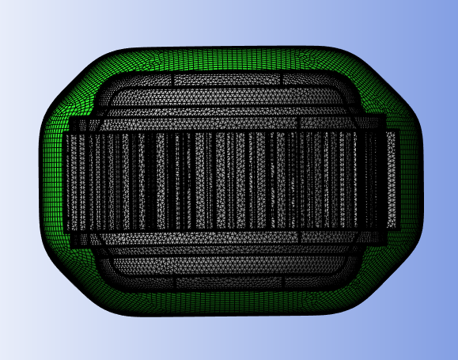

# Convex Irregular Shape Enclosure

**Convex Irregular Shape Enclosure** control automatically creates 
a convex enclosure of the input scope.
The convex enclosure adapts to the input scope shape 
to minimize the internal enclosed volume using the provided parameters.

**Convex Irregular Shape Enclosure Details** view has the following options:

**General**

* **[Control Type](../controls.md)**

**Scope**
* **[Define By](../controls.md)**
* **[Scoping Method](../controls.md)**

    Only **Part** can be selected for creating **Convex Irregular Shape Enclosure**.
* **[Scoping Pattern](../controls.md)**

**Definition**

* **Define By**: Allows you to define the element size based on value or settings.
  The available options are:
  * **Value**: Defines the element size based on the provided value.

  * **Settings**: Defines the element size based on the settings under
  **Mesh Settings** in the **Steps Details** view.

* **Element Size**: Provides the element size.
  
  When **Define By** is **Value**, you can specify the element size. 
 
  When **Define By** is **Settings**, displays the element size calculated 
  based on the provided **Mesh Settings** in the **Steps Details** view. 
  The **Element Size** is read-only.

  You can click  on the right corner of the 
  option and click **Publish** to publish **Element Size** to the **Property Worksheet**.
  
  You can parameterize **Element Size** only when **Defined By** is **Value**.

* **Mesh Type**: Allows you to select the type of mesh to be used for meshing.
The default value is **Quadrilaterals**. 
The available options are:
  * **Triangles**: Creates mesh with triangular elements.
  * **Quadrilaterals**: Creates mesh with quadrilateral elements.

* **Scale Factor**: Allows you to define minimal increase in size of 
the convex enclosure with respect to the input scope.
You can click  on the right corner 
of the option and click **Publish** to publish **Scale Factor** to the **Property Worksheet**.
The default value is **1.0**.

* **Distance**: Allows you to specify the absolute distance to change 
the enclosure distance from the model. The default value is **0.0 mm**.

* **Number of Layers**: Allows you to specify the minimal number of volumetric 
layers to be created between the model and the enclosure.
The default value is **2**.
You can click  on the right corner
of the option and click **Publish** to publish **Number of Layers** to the **Property Worksheet**.

* **Smoothing Iterations**: Allows you to provide the number of smoothing iterations required.
The default value is **5**.
You can click  on the right corner of 
the option and click **Publish** to publish **Smoothing Iterations** to the **Property Worksheet**.

* **Smoothing Preserve Volume**: Allows you to preserve the volume after 
smoothing when **Smoothing Preserve Volume** is **Yes**.
The default value is **No**.

* **Geometry Fidelity Option(Beta)**: Allows you to preserve the features of the scoped region 
when **Geometry Fidelity Option** is **Yes**. 
The default value is **No**.