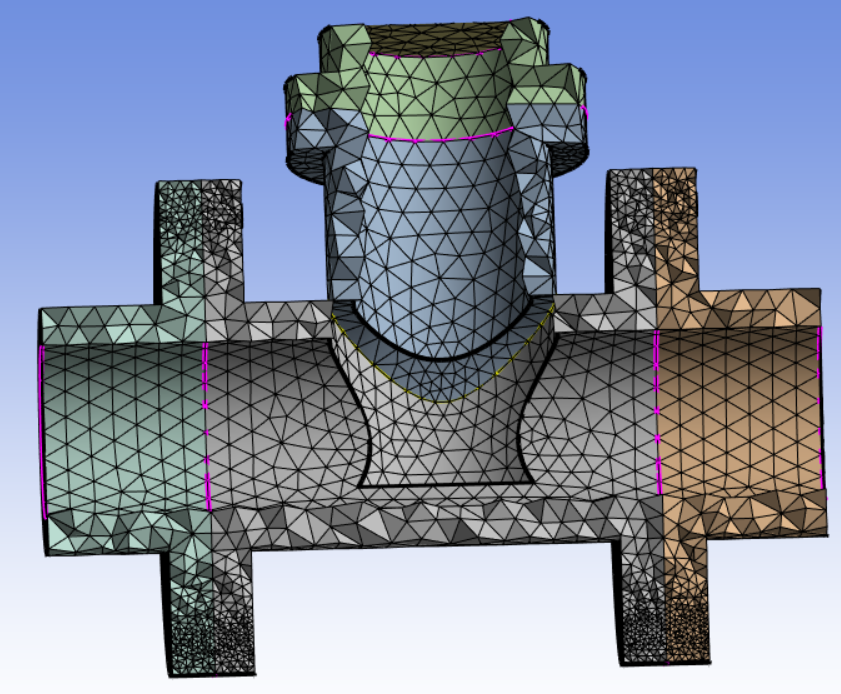

# Curvature Sizing

**Curvature Sizing** control allows you to refine the surface mesh to capture the underlying curve and surface curvature.

**Curvature Sizing Details** view has the following options:

**General**

* **[Control Type](../controls.md)**: Displays the selected control type.

**Scope**

* **[Scoping Method](../controls.md)**: Allows you to select the entities for the selected control.
The available options are:

  * **Part**: Allows you to select Parts for defining the scope of the control.

  * **Label**: Allows you to select Labels for defining the scope of the control.

  * **Zone**: Allows you to select Zones for defining the scope of the control.

   
* **[Scoping Pattern](../controls.md)**: Allows you to specify the name pattern to get the selected **Scoping Method**.
 **Scoping Pattern** supports **Regular Expression**.

**Definition**

* **Define By**: Allows you to scope the operation based on your selection. The available options are:

   - **Value**: Allows you to define the maximum size based on the provided element size.
   - **Settings**: Allows you to define the maximum size based on the defined Steps settings.

* **Growth Rate**: Allows you to specify the increase in element edge length with each
 succeeding layer of elements. The default value is **1.2**.
 For **Stacker Mesh Workflow**, the default value is **1.5** based on **Global Settings**.

* **Min Size**: Allows you to specify a minimum size to be used for curvature sizing calculation.
* **Max Size**: Allows you to specify a maximum size to be used for curvature sizing calculation.
* **Normal Angle**: Allows you to specify the maximum allowable angle at which one element edge 
is allowed to span for the specified curvature. The default value is **18 degrees**.
For **Stacker Mesh Workflow**, the default value is **30 degrees** based on **Global Settings**.
* **Use CAD Curvature**: Allows you to use the curvature of the underlying geometry in the model for computing size field when **Use CAD Curvature** is **Yes**. The default value is **Yes**.
When **Use CAD Curvature** is **No**, the control uses faceted geometry for curvature calculation and geometry projection.