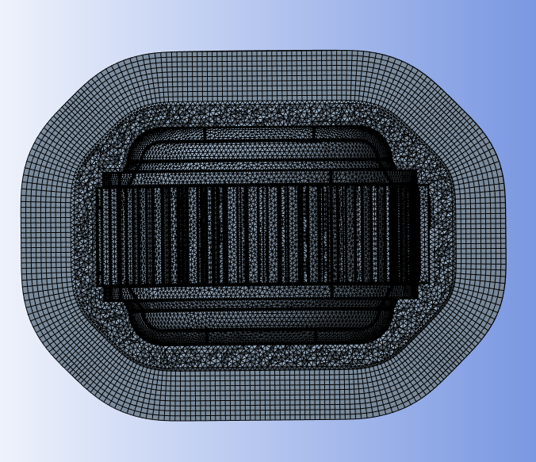
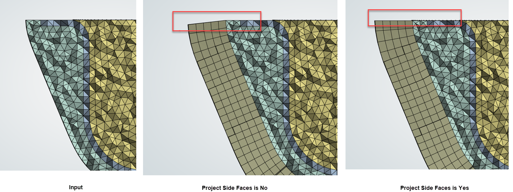

# Extrusion

**Extrusion** control creates extruded layers from the input surface for a specified number of layers with specified height.

**Extrusion Details view** has the following options:

**General**

* **[Control Type](../controls.md)**

**Scope**

* **[Define By](../controls.md)**
* **[Scoping Method](../controls.md)**
* **[Scoping Pattern](../controls.md)** 

**Definition**

* **Define By**: Allows you to perform extrusion based on value or settings.
  The available options are:
  * **Value**: Performs extrusion based on **Per Layer Height** and **Number of Layers**.

  * **Settings**: Performs extrusion based on the settings under
  **Mesh Settings** in the **Steps Details** view.

* **Per Layer Height**: Allows you to specify the height of each layer of solid elements. The default value is **10 mm**.
  
  You can click   on the right corner
  of the option and click **Publish** to publish **Per Layer Height** to the **Property Worksheet**.

  You can parameterize **Per Layer Height** only when **Defined By** is **Value**.

* **Number of Layers**: Allows you to specify the number of layers to be used for extruding the model. The default value is **2**.
  
  You can click  on the right corner 
  of the option and click **Publish** to publish **Number of Layers** to the **Property Worksheet**. 
  
  You can parameterize **Number of Layers**  only when **Defined By** is **Value**.

  Note: For External FEM Acoustics, you can create PML layers using extrusion.

* **Project Side Faces**: Allows you to project the side faces after extruding when **Project Side Faces** is **Yes**. The default value is **No**.

  

> Note: **Project Side Faces** is useful in 
**Hemiconvex Irregular Shape Enclosure**. When **Project Side Faces** is **Yes**, it maintains the side faces of extruded mesh aligned with plane of the enclosure base face.

* **Merge Side Faces**: Allows you to merge the side face after extruding when **Merge Side Faces** is **Yes**.
The default value is **No**.

* **Growth Rate**: Allows you to specify the increase in element edge length with each succeeding layer of elements. The default value is **1.0**.