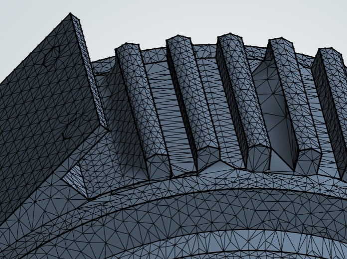
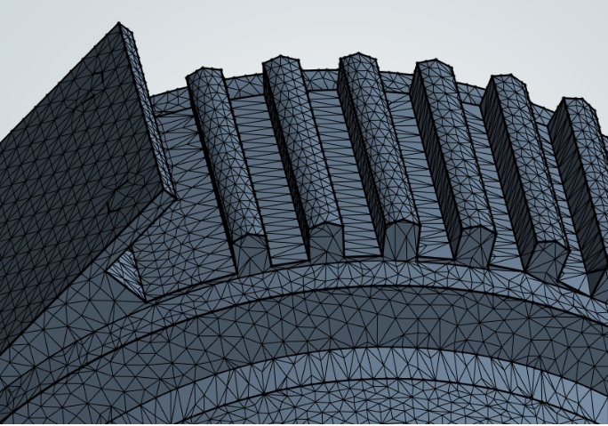

### Geometry Fidelity

**Geometry Fidelity** is an wrapper feature that improves the edge feature capture after wrapper projection.

**Geometry Fidelity** uses faces as input. When you scope a **Part**, **Geometry Fidelity** includes all faces in that part. If you use a **Label**, label must contain faces. When you scope by **Zone**, the **Geometry Fidelity**  processes only **Face Zones**, not **Volume Zones** or **Edge Zones**.

The following image shows the **Wrap** operation without **Geometry Fidelity**.

 

 The following image shows the **Wrap** operation with **Geometry Fidelity**.

  |

**Geometry Fidelity Details** view has the following options:

**General**

* **[Control Type](../controls.md)**: Displays the selected control type.

**Scope**

* **[Scoping Method](../controls.md)**: Allows you to select the entities for the selected control.
The default value is **Label**.
The available options are:
  * **Part**: Allows you to select parts for defining the scope of the control.
  * **Label**: Allows you to select labels for defining the scope of the control.
  * **Zone**: Allows you to select zones for defining the scope of the control.

* **[Scoping Pattern](../controls.md)**: Allows you to specify the name pattern to get the selected **Scoping Method**.
 **Scoping Pattern** supports **Regular Expression**.You can click  on the right corner of the option and the following options are available:
    * **Publish**: Publishes **Scoping Pattern** to the **Property Worksheet**. 
    * **Scope All**: Inserts '.*' regular expression to scope all enitities.

**Definition**

* **Capture Internal Edges**: Allows you to capture internal edges to preserve geometric features when **Capture Internal Edges** is **Yes**.