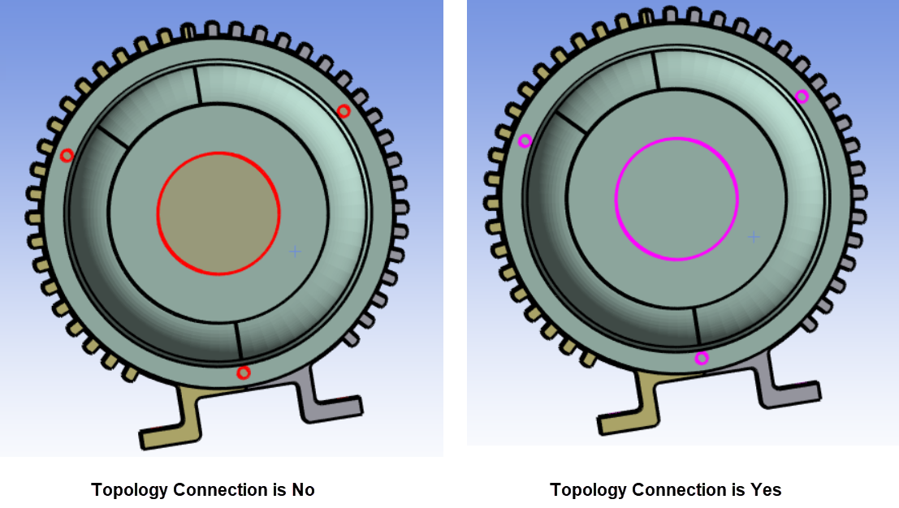

# Hole Filling

**Hole Filling** allows you to create patch surfaces to close holes in the surface meshes.

**Hole Filling Details** view has the following options:

**General**

* **[Control Type](../controls.md)**

**Scope**

* **[Scoping Method](../controls.md)**
* **[Scoping Pattern](../controls.md)** 

**Definition**

* **Label Name**: Allows you to label the created face zone with the specified name.
* **Topology Connection**: Allows you to create a connected topology for the newly created faces when **Topology Connection** is **Yes**. The default value depends on the selected workflow type.
When **Topology Connection** is **Yes**, hole edges should be continous to perform fill holes operation.
* **Part Name**: Allows you to provide the name of the created part where new faces are defined.**Part Name** is available only when
 **Topology Connection** is **No**.
* **Face Zone Name**: Allows you to name the created face zone.

