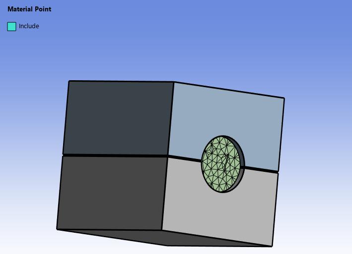
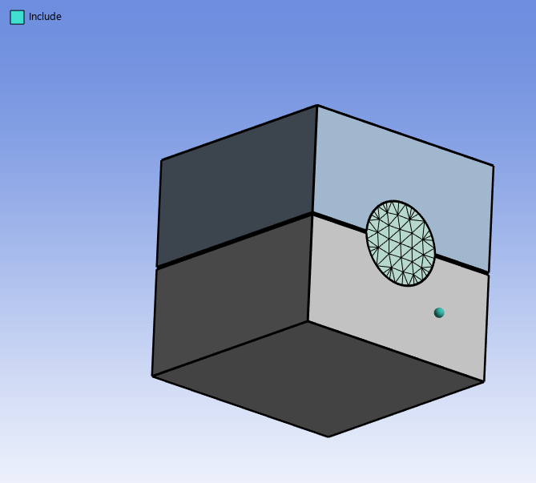
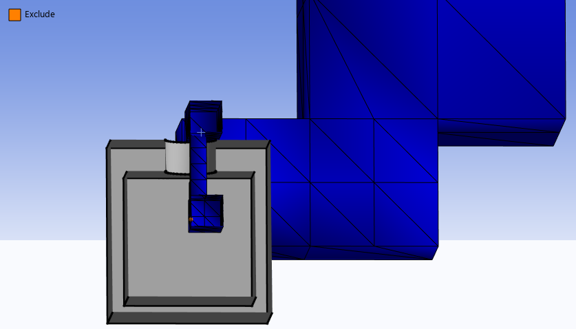

# Material Point

**Material Point** is a coordinate point defined in a specific region that helps the mesher to identify the region of interest for performing the operation.
A 3D coordinate provides the position of the material point along X, Y and Z coordinates.
You can parametrize **X Coordinate, Y Coordinate and Z Coordinate**.

 The application of **Material Points** in different operations are as follows:

**Patch Holes**

In **Patch Holes** operation, the default material point is **Include**. For **Patch Holes** operation, only coordinate position of the material point is relevant irrespective of the type.

Here, when the material point is located inside the box, creates the patch surfaces on the inner side of the box.

Here, when the material point is located outside the box, creates the patch surfaces on the outer side of the box.

**Leak Detection**

In **Leak Detection**, you must have an **Exclude** material point to detect leaks. 

A leak path is created between the wrapped region and Exclude material point that helps to trace the leaks in the model.

**Wrap**

Wrapping is based on the **Live Region Type** defined in the wrapper.
By default, the **Live Region Type** is **External** and the wrapper wraps from outside. 
When you select **Live Region Type** as **Material Point**, you should define an **Include** material point for wrapping.

**Material Point Details** view has the following options:

**General**

* **[Control Type](../controls.md)**

**Definition**

* **Coordinate Define By**:  Allows you to define the material point.
The available options are:
  * **Location**: Allows you to use the coordinates from a picked location to define the material point. You can select any location and
   Click **Apply** in **Coordinate** to get the coordinates of the selected location.
   When **Coordinate Define By** is **Location**, the available option is:
    * **Coordinate**: Allows you to select the location coordinate based on your selection in the Geometry window.
  * **Coordinate System**: Allows you to specify the coordinate system to define the material point.
  When **Coordinate Define By** is **Coordinate System**, the available option is:
      * **Coordinate System**: Allows you to select the defined coordinate systems for the material points. You can click  to select from the available list of coordinate systems that are defined under the **Coordinate Systems** object in the **Tree** outline.
  * **Geometry Selection**: Allows you to select the geometry to define the material point. Material point is created at the centroid of the selected geometry.
    * **Coordinate**: Allows you to specify the coordinates of the centroid for the selected geometry in the **Geometry** window.
  
* **X Coordinate**: Displays the X coordinate of the material point based on the selected **Coordinate Define By** option.
* **Y Coordinate**: Displays the Y coordinate of the material point based on the selected **Coordinate Define By** option.
* **Z Coordinate**: Displays the Z coordinate of the material point  based on the selected **Coordinate Define By** option.
   
   You can paramterize the **X Coordinate**, **Y Coordinate** and **Z Coordinate**.
* **Name**: Allows you to provide name for the material point.
You can click    on the 
right corner of the option and click **Publish** to add 
**Name** to the **Property Worksheet**. 

* **Material Point Type**: Allows you to select the type of material point. The available options are **Include** and **Exclude**.
The default value is **Include**.
  * **Include**: A reference point located in your region of interest for performing the operation.

  * **Exclude**: A reference point located anywhere other than the region of interest defined by the **Include** material point for performing the operation. You should use **Exclude** material point for leak detection under **Wrap** operation.
 **Material Point Type** is available only for **Wrap** operation.
  