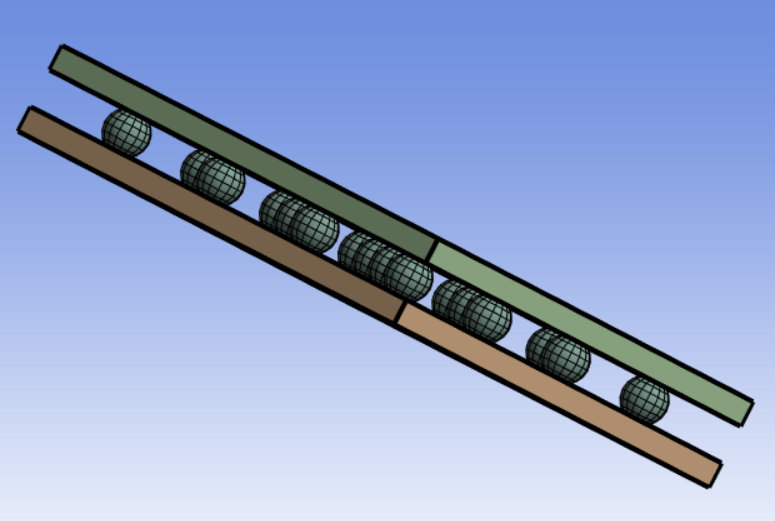
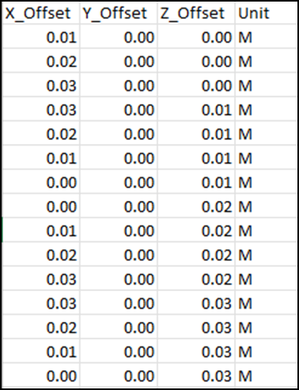

### Mesh Replication

**Mesh Replication** duplicates the volume meshed bodies and moves the copies based on displacements defined in a .csv or .txt file.

The below image shows a structured .csv file for mesh replication. Each row defines a set of X, Y, Z displacement coordinates and a corresponding units.

**Mesh Replication Details** view has the following options:

**General**

* **[Control Type](../controls.md)**: Displays the selected control type.

**Scope**

* **[Define By](../controls.md)**: Allows you to define the input to the selected control.
The available options are **Value** and **Outcome**.

  * **Value**: Allows you to set manually the value of the **Scoping Method** and **Scoping Pattern**.

  * **Outcome**: Allows you to select the existing scoped outcomes from the previous steps as input.

* **[Scoping Method](../controls.md)**: Allows you to select the entities for the selected control.
The available options are:

  * **Part**: Allows you to select parts for defining the scope of the control.

  * **Label**: Allows you to select labels for defining the scope of the control.

  * **Zone**: Allows you to select zones for defining the scope of the control.

* **[Scoping Pattern](../controls.md)**: Allows you to specify the name pattern to get the selected **Scoping Method**.
  **Scoping Pattern** supports **Regular Expression**. You can click  on the right corner of the option and the following options are available:
    * **Publish**: Publishes **Scoping Pattern** to the **Property Worksheet**. 
    * **Scope All**: Inserts '.*' regular expression to scope all enitities.

**Definition**

* **Offset File Name:** Allows you to import the X, Y, Z offset coordinates along with the units,
   defined in the .csv file or .txt file.
* **Merge Replicate Bodies** Allows you to merge the replicated bodies to the corresponding 
    parent bodies when **Merge Replicate Bodies** is **Yes**. The default value is **No**.