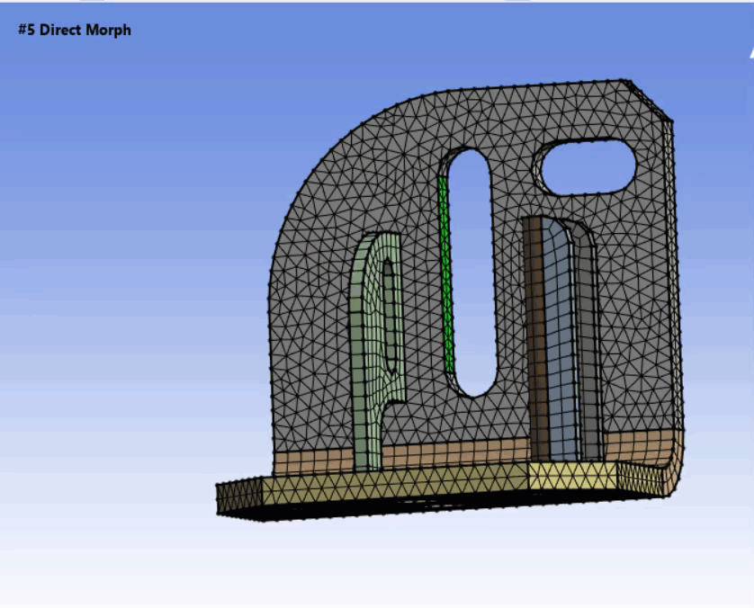

# Offset Morphing

**Offset Morphing** allows you to morph the selected edges or faces 
along the surface normal within the specified offset distance.

**Offset Morphing Details** view has the following options:

**General**

* **Control Type**: Allows you to specify the type of morph control to be used.

**Control Scope**

* **Control Scoping Method**: Allows you to scope the entities where you want 
to prescribe the displacements for morphing.
You can scope **Part** and **Label** entities.

* **Control Scoping Pattern**:  Allows you to specify the name pattern to scope 
entities prescribed for displacements while morphing.
 You can click  on the right corner of the 
 option and the following options are available:

   * **Publish**: Publishes **Control Scoping Pattern** to the **Property Worksheet**. 
   * **Scope All**: Inserts '.*' regular expression to scope all entities.

**Fixed Scope**

* **Fixed Scoping Method**: Allows you to scope the entities that you want to 
prescribe as fixed while morphing. You can only scope entities with **Label**.

* **Fixed Scoping Pattern**: Allows you to specify the name pattern to scope entities
 prescribed as fixed while morphing.
 You can click  on the right corner of the 
 option and the following options are available:

   * **Publish**: Publishes **Fixed Scoping Pattern** to the **Property Worksheet**. 
   * **Scope All**: Inserts '.*' regular expression to scope all entities.
   
**Rigid Scope**

* **Rigid Scoping Method**:  Allows you to scope the entities where you want to 
prescribe displacement without any deformation while morphing.
You can only scope entities with **Label**.

* **Rigid Scoping Pattern**:Allows you to specify the name pattern to scope entities 
that you want to prescribe displacement without any deformation while morphing.
You can click  on the right corner of the 
 option and the following options are available:

   * **Publish**: Publishes **Rigid Scoping Pattern** to the **Property Worksheet**. 
   * **Scope All**: Inserts '.*' regular expression to scope all entities.
   

**Morphable Scope**

* **Morphable Scoping Method**: Allows you to scope the entities that are allowed 
to morph based on the movements of the control scope.
You can only scope entities with **Label**.

* **Morphable Scoping Pattern**: Allows you to specify the name pattern to scope 
selected entities that are allowed to morph based on the movements of the control scope.
You can click  on the right corner of the 
 option and the following options are available:

   * **Publish**: Publishes **Morphable Scoping Pattern** to the **Property Worksheet**. 
   * **Scope All**: Inserts '.*' regular expression to scope all entities.

**Definition**

* **Distance**: Provides the distance for morphing along the surface normal direction. 
The value can be negative or positive. 
You can click   on the right corner of 
  the option and click **Publish** to publish **Distance** to the **Property Worksheet**.
You can parameterize **Distance**.