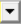

### Proximity Label Addition

**Proximity Label Addition** allows you to create a single label from the scoped parts, zones or labels based on the entities located within a specified location and proximity radius.

**Proximity Label Addition Details** view has the following options:

**General**

* **[Control Type](../controls.md)**: Allows you to select the control type.

**Scope**

* **[Scoping Method](../controls.md)**: Allows you to scope Part, Label or Zone as input for the 
**Single Zone Creation** control.

* **[Scoping Pattern](../controls.md)**: Allows you to specify the name pattern to get the selected **Scoping Method**.
 **Proximity Label Creation** supports **Regular Expression**.
You can click  on the right corner of the option and the following options are available:
    * **Publish**: Publishes **Scoping Pattern** to the **Property Worksheet**. 
    * **Scope All**: Inserts '.*' regular expression to scope all entities.

**Definition**

* **Coordinate Define By**:  Allows you to define the location for creating the labels.
The available options are:

  * **Location**: Allows you to use the coordinates from a picked location to define the specified location.
   You can select any location and click **Apply** in **Coordinate** to get the coordinates of the selected location.
   When **Coordinate Define By** is **Location**, the available option is:
    * **Coordinate**: Allows you to select the location coordinate based on your selection in the Geometry window.
  * **Coordinate System**: Allows you to specify the coordinate system to define the specified  location.
  When **Coordinate Define By** is **Coordinate System**, the available option is:
      * **Coordinate System**: Allows you to select the defined coordinate systems for the specified location. You can click  to select from the available list of coordinate systems that are defined under the **Coordinate Systems** object in the **Tree** outline.

  * **Geometry Selection**: Allows you to use the coordinates from the centroid of the selected geometry to define the specified location.
    * **Coordinate**: Allows you to specify the coordinates of the centroid for the selected geometry in the **Geometry** window.
      You can click **Apply** in **Coordinate** to get the coordinates of the centroid of the selected geometry.

* **X Coordinate**: Displays the X coordinate of the location based on the selected **Coordinate Define By** option.
* **Y Coordinate**: Displays the Y coordinate of the location point based on the selected **Coordinate Define By** option.
* **Z Coordinate**: Displays the Z coordinate of the location point  based on the selected **Coordinate Define By** option.

    You can click   on the right corner of the option and click **Publish** to add **X Coordinate**, **Y Coordinate** and **Z Coordinate** to the **Property Worksheet**.
   You can paramterize the **X Coordinate**, **Y Coordinate** and **Z Coordinate**.

* **Proximity Type**: Allows you to specify the type of proximity search used for detecting the enitities. 
The default value is **Radius**.
The available options are:
  * **Radius**: Provides label for the entities within the specified **Proximity Radius**.
  * **Closest**: Provides label only to the closest entity of the selected the input scope.

  * **Proximity Radius**: Defines the range for detecting and scoping the nearby entities type. The default value is **0.001 mm**. 
  You can click   on the right corner of the option and click **Publish** to add  **Proximity Radius** to the **Property Worksheet**.
  You can parametrize **Proximity Radius**.

* **Entity Type**: Allows you to select the entities type for the label creation. The available options are **Node**, **Edge**, **Face** and **Volume**.
* **Label Name**: Allows you to provide the  label name for the created label. 
You can click   on the right corner of the option and click **Publish** to add  **Label Name** to the **Property Worksheet**. 