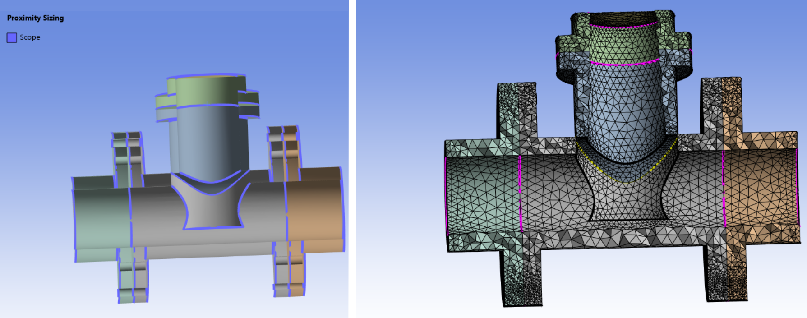

# Proximity Sizing

**Proximity Sizing** control allows you to compute edge and face sizes in gaps using the specified minimum number of element layers.

**Proximity Sizing Details** view has the following options:

**General**

* **[Control Type](../controls.md)**: Displays the control type.

**Scope**

* **[Scoping Method](../controls.md)**: Allows you to select the entities for the selected control.
The available options are:

  * **Part**: Allows you to select Parts for defining the scope of the control.

  * **Label**: Allows you to select Labels for defining the scope of the control.

  * **Zone**: Allows you to select Zones for defining the scope of the control.

* **[Scoping Pattern](../controls.md)**: Allows you to specify the name pattern to get the selected **Scoping Method**.
 **Scoping Pattern** supports **Regular Expression**.

**Definition**

* **Define By**: Allows you to scope the operation based on your selection. The available options are: 
    - **Value**: Allows you to define the maximum size based on the provided element size.
    - **Settings**: Allows you to define the maximum size based on the defined acoustic settings.

* **Growth Rate**: Allows you to specify the increase in element edge length
  with each succeeding layer of elements. The default value is **1.2**.
* **Min Size**: Allows you to specify a minimum size to be used for proximity sizing calculation.
* **Max Size**: Allows you to specify a maximum size to be used for proximity sizing calculation.
* **Element Per Gap**: Allows you to specify the minimum number of layers of elements to be 
  generated in the gap. The default value is **3**.
* **Ignore Self Proximity**: Ignores the proximity between two faces in the same face zone 
  when **Ignore Self Proximity** is **Yes**. The default value is **Yes**.
* **Ignore Orientation**: Ignores the face normal orientation while calculating the proximity 
  when **Ignore Orientation** is **Yes**. The default value is **No**.
