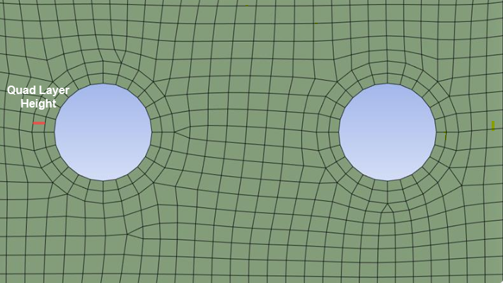

# Quad Layer

**Quad layer** control enables you to scope circular edge loops and creates layers of quadrilateral elements around them based on the specified parameters.

**Quad Layer** Details view has the following options:

**General**

* **[Control Type](../controls.md)**: Displays the control type.

**Scope**

* **Define By**: Allows you to define the input scope of the quad layer control.
The available options are:
  * **Value**: Allows you to set manually the value of the **Scoping Method** and **Scoping Pattern**.
   * **Outcome**: Allows you to select the existing scoped outcomes from the previous steps as input.

* **Scoping Method**: Allows you to select the entities for the selected control.
The available options are:

  * **Part**: Allows you to select Parts for defining the scope of the control.

  * **Label**: Allows you to select Labels for defining the scope of the control.

  * **Zone**: Allows you to select Zones for defining the scope of the control.

* **Scoping Pattern**: Allows you to specify the name pattern to get the selected **Scoping Method**.
 **Scoping Pattern** supports **Regular Expression**.
 You can click  on the right corner of the option and the following options are available:
    * **Publish**: Publishes **Scoping Pattern** to the **Property Worksheet**. 
    * **Scope All**: Inserts '.*' regular expression to scope all entities.

**Definition**

* **Define By**: Allows you to define the growth rate for the quad layer.
The available options are:
  * **Value**: Allows you to provide the growth rate for the quad layers.
  * **Settings**: Allows you to defines the growth rate as per the settings in the Step Details view.

> Note: **Define By** option is available only when growth rate is defined in the settings under the Step Details view.

* **Number of Divisions**: Allows you to divide the quad layer edge into the specified the number of divisions. 
  The default value is 6.
  You can click  on the right corner of the
  option and click **Publish** to publish **Number of Divisions** to the **Property Worksheet**. 
  You can parameterize the **Number of Divisions**.

**Number of Layers**: Allows you to specify the required number of quad layers to be created. 
The default value is **1**.
You can click  on the right corner of the
option and click **Publish** to publish **Number of Layers** to the **Property Worksheet**. 
You can parameterize the **Number of Layers**.

**Growth Rate**: Allows you to specify the width ratio between the adjacent quad layers.
The default value is **1.2**.
>Note: For **Stacker Mesh Workflow**, the default value is **1.5**.

You can click  on the right corner of the
option and click **Publish** to publish **Growth Rate** to the **Property Worksheet**. You can parameterize the **Growth Rate**.

**First Layer Height**: Allows you to specify the height of the first quad layer. 
You can click  on the right corner of the
option and click **Publish** to publish **First Layer Height** to the **Property Worksheet**.
You can parameterize the **First Layer Height**.

**Quad Layers Face Scope**

* **Face Scoping Method**: Allows you to select the entities on which the quad layer is to be grown.
  The available options are:

  * **Part**: Allows you to select Parts for growing the quad layer.

  * **Label**: Allows you to select Labels  for growing the quad layer.

  * **Zone**: Allows you to select Zones for  for growing the quad layer.
  
* **Face Scoping Pattern**: Allows you to specify the name pattern to get the selected **Scoping Method**.
 **Scoping Pattern** supports **Regular Expression**.
 You can click  on the right corner of the option and the following options are available:
    * **Publish**: Publishes **Scoping Pattern** to the **Property Worksheet**. 
    * **Scope All**: Inserts '.*' regular expression to scope all entities.

> Note: **Quad Layers Face Scope** allows you to specify the face on which the quad layer grows.
**Quad Layers Face Scope** is optional. When you do not specify the faces to be scoped, 
  quad layer scopes all attached faces to the edge.