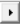

### Size Field MultiZone: Mesh Surface

**Size Field MultiZone: Mesh Surface** creates a multizone surface mesh with the 
sizing defined in the input size field.

**Size Field MultiZone: Mesh Surface Details** view has the following options:

**General**

* **[Control Type](../controls.md)**: Allows you to select the control type.

**Scope**

* **[Define By](../controls.md)**: Allows you to define the input to the selected control.
The available options are **Value** and **Outcome**.

  * **Value**: Allows you to set manually the value of the **Scoping Method** and **Scoping Pattern**.

  * **Outcome**: Allows you to select the existing scoped outcomes from the previous steps as input.

* **[Scoping Method](../controls.md)**: Allows you to select the entities for the selected control.
The available options are:

  * **Part**: Allows you to select parts for defining the scope of the control.

  * **Label**: Allows you to select labels for defining the scope of the control.

  * **Zone**: Allows you to select zones for defining the scope of the control.

* **[Scoping Pattern](../controls.md)**: Allows you to specify the name pattern to get 
  the selected **Scoping Method**.
  **Scoping Pattern** supports **Regular Expression**. You can click 
   on the right corner of the option and 
  the following options are available:
    * **Publish**: Publishes **Scoping Pattern** to the **Property Worksheet**. 
    * **Scope All**: Inserts '.*' regular expression to scope all entities.

**Definition**

* **Define Size Field By**: Allows you to define the size field for the MultiZone mesh surface.
  The available options are:

  * **Value**: Allows you to manually set the value of the **Size Field Name Pattern**.

  * **Outcome**: Allows you to select the existing scoped outcomes from the previous steps as input.

* **Size Field Name Pattern**: Allows you to specify the name pattern of size fields 
  to be activated for surface meshing.

* **Mesh Based Defeaturing**:  Allows you to defeature the features with tolerance value less than the defined tolerance. 
  The default value is **Program Controlled**. The available options are:
  * **Program Controlled**: Determines automatically defeature tolerance for the scoped parts, zones or labels.
  * **User Defined**: Allows you to specify the defeature tolerance defined in the **Defeature Tolerance** option. 
      When **Defeaturing Tolerance Definition** is **User Defined**, the available option is:
      * **Defeature Tolerance**: Allows you to specify the defeature tolerance. You can parametrize **Defeature Tolerance**. 
          You can  click  on the right corner of the option and click **Publish** to publish **Defeature Tolerance** to the **Property Worksheet**.

  * **Free Face Mesh Type**: Allows you to select the mesh type  for the free mesh surface elements.
      The default value is **All Quad**. The available options are: 

      * **Tri/Quad**: Instructs MultiZone that the free face mesh has to be a quad mesh and allow some triangles.

      * **All Tri**: Instructs MultiZone that the free face mesh has to be a triangular mesh.

      * **All Quad**: Instructs MultiZone that the free face mesh has to be a quadrilateral mesh.

* **Match Edge Spacing**: Allows you to match  node spacing between the edges when **Match Edge Spacing** is **Yes**.

* **Retain Existing Mesh**: Allows you to retain the existing surface mesh during the 
  **Size Field MultiZone: Mesh Surface** control when **Retain Existing Mesh** set to **Yes**. 
  The default value is **Yes**.

* **Meshed Surfaces Label Suffix**: Provides the suffix to be added to the label of a meshed surface.
    You can click  on the right corner of the option and click **Publish**
    to publish **Meshed Surfaces Label Suffix** to the **Property Worksheet**.

**Input Mesh**

* **Define By**: Allows you to scope the parts, zones or labels to preserve the mesh for the 
  **Size  Field MultiZone: Mesh Surface** control.
The available options are **Value** and **Outcome**.

  * **Value**: Allows you to set manually the value of the **Input Mesh Scoping Method** and **Input Mesh Source/Target Scoping Pattern**.

  * **Outcome**: Allows you to select the existing scoped outcomes from the previous steps as input.

* **Input Mesh Scoping Method**:  Allows you to preserve the mesh for scoped parts, zones or labels 
    defined in the **Input Mesh Scoping Pattern**.
The available options are:

  * **Label**: Allows you to select labels for defining the scope of the  **Source/Target Scoping Method**.

  * **Zone**: Allows you to select zones for defining the scope of the **Source/Target Scoping Method**.

* **Input Mesh Scoping Pattern**: Allows you to specify the name pattern to get the selected **Input Mesh Scoping Method**.
 **Input Mesh Scoping Pattern** supports **Regular Expression** . You can click  on the right corner of the option and the following options are available:
    * **Publish**: Publishes **Input Mesh Scoping Pattern** to the **Property Worksheet**. 
    * **Scope All**: Inserts '.*' regular expression to scope all entities.

