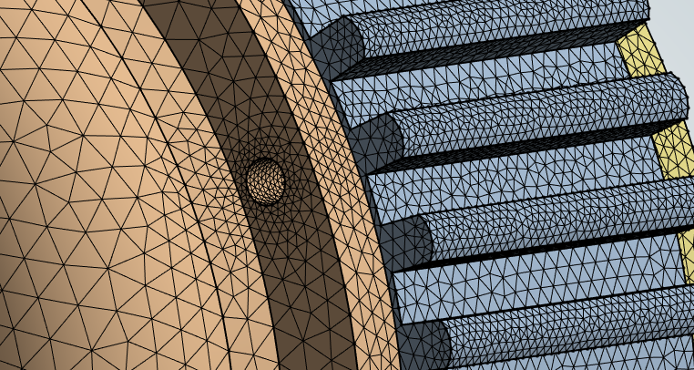

# Size Field Surface Mesher

**Size Field Surface Mesher** control allows you to mesh the surface of the model with the sizing defined in the size field provided as input.

**Size Field Surface Mesher Details** view has the following options:

**General**

* **[Control Type](../controls.md)**: Displays the selected control type.

**Scope**

* **[Scoping Method](../controls.md)**: Allows you to scope Part,Label or Zone as input for the **Size Field Surface Mesher** control.

* **[Scoping Pattern](../controls.md)**: Allows you to specify the name pattern to get the selected **Scoping Method**.
 **Scoping Pattern** supports **Regular Expression**.

**Definition**
* **Define Size Field By**: Allows you to define the size field name pattern. The available options are:
  * **Value**: Allows you to provide the size field name pattern manually.
  * **Outcome**: Allows you to select an existing size field outcome from a previous step.
*	**Size Field Name Pattern**: Allows to specify the name pattern of size fields to be activated for the surface meshing.
*	**Mesh Type**: Allows you to select the type of mesh you want to generate. 
The default value is **Quadrilaterals**.
The available options are:
    * **Triangles**: Creates mesh with triangular elements.
    * **Quadrilaterals**: Creates mesh with quadrilateral elements.
* **Project On Geometry**: Allows you to project the created mesh on the underlying geometry when **Project On Geometry** is **Yes**. The default value is **Yes**.
* **Retain Existing Mesh**: Allows you to retain the mesh on the already meshed topofaces while remeshing when **Retain Existing Mesh** is **Yes**.
The default value is **No**.
* **Preserve Boundaries(Beta)**: Allows you to preserve the boundaries when **Preserve Boundaries** is **Yes**.
* **Skewness Limit**: Allows you to specify the maximum skewness limit for the the face elements. 
The default value is **0.9**.

