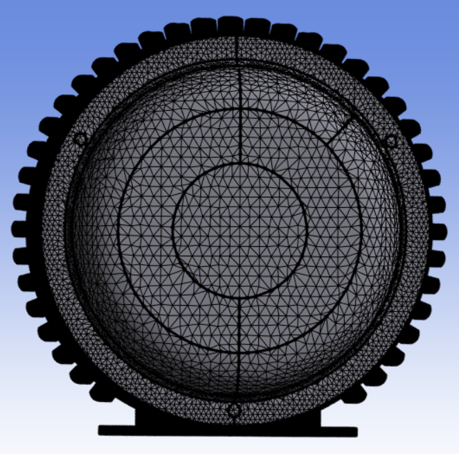

# Size Field Wrapper

**Size Field Wrapper** control allows you to wrap the model with the sizing defined in the size field provided as input.

 **Size Field Wrapper Details** view has the following options:

**General**

* **[Control Type](../controls.md)**: Allows you to select the control type for the selected operation.

**Scope**

* **[Scoping Method](../controls.md)**: Allows you to scope **Part** as input for the **Size Field Wrapper** control.

* **[Scoping Pattern](../controls.md)**: Allows you to specify the name pattern to get the selected **Scoping Method**.
 **Scoping Pattern** supports **Regular Expression**.

 * **Target Scoping Method (Beta)**: Allows you to merge the newly created part of the wrapper to the existing part automatically.
Only **Part** can be selected for target scoping in **Size Field wrapper**. 

* **Target Scoping Pattern (Beta)**: Allows you to specify the name pattern to get the selected target **Scoping Method**. 
For more information, refer **[Scoping Pattern](../controls.md)**.

**Definition**

* **Define Size Field By**:  Allows you to define the size field name pattern.
    The available options are:
  * **Value**: Allows you to provide the size field name pattern manually.
  * **Outcome**: Allows you to select an existing size field outcome from a previous step.

* **Size Field Name Pattern**: Allows to specify the name pattern of size fields to be 
activated for the wrapper operation.

* **Scale Factor**: Allows you to specify the factor to scale the 
element size values defined by settings.
The default value is **1.0**.
You can click on the right corner of the option and click **Publish** to 
publish **Scale Factor** to the **Property Worksheet**.

* **Live Region Type**: Allows you to select the region type to extract the wrap region.
 The available options are:

  - **Material Point**: Allows you to define the volume of the model being wrapped. 
    The material point is set  locally along with X, Y and Z coordinates. 
    For **Internal FEM Acoustics**, the default value is **Material Point**.

    - **External**: Allows you to wrap the surface from the external region. 
    
    * **Largest Internal**: Allows you to define the largest internal 
    region of the model as the region for wrapping. 
    For **External FEM Acoustics** and **BEM Acoustics workflows**, 
    the default value is **Largest Internal**.

* **Delete Input Scope**: Allows you to delete the input source of the model after wrapping when **Delete Input Scope** is **Yes**.
The default value is **Yes**.

* **Exclude Enclosure**: Allows you to exclude the external region and wrap inner parts only for the box in box models when **Exclude Enclosure** is **Yes**. The default value is **No**.

* **Face Zone By Part**: Creates a face zone for each part of the input scope when **Face Zone By Part** is **Yes**. The created face zones are converted to named selections in Mechanical after completing the mesh workflow. When **Face Zone By Part** is **No**, creates a single face zone for the whole input scope. Hence, only a single named selection is available for Mechanical after completing the mesh workflow. The default value is **No**. 

* **Wrap by Part**: Allows you to perform  a separate wrap 
for each part of the input scope automatically when **Wrap by Part**
is **Yes**.  The default value is **No**.

* **Reverse Surface Orientation**: Allows you to reverse the orientation of the created face zonelets. The default value is **No**. When **Reverse Surface Orientation** is **No**, the orientation is same as the position of the **Live** material point for the wrapper. When **Reverse Surface Orientation** is **Yes**, the orientation is opposite to the position of the **Live** material point for wrapper. **BEM Acoustics** uses **Reverse Surface Orientation** where you need to wrap the external and solve the internal field.
