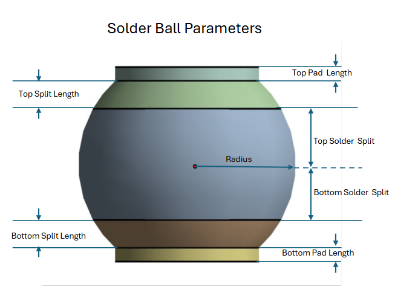
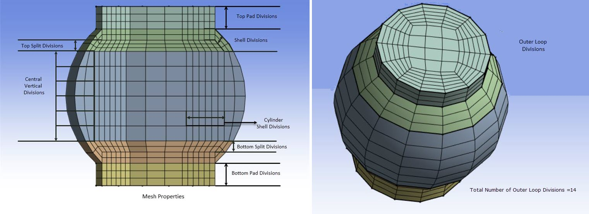
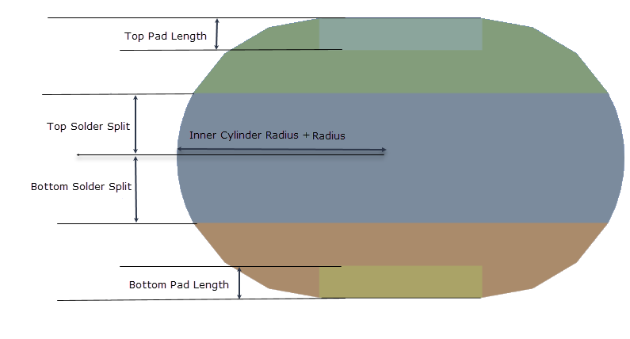

# Solder Ball Creation

**Solder Ball Creation** allows you to define the solder ball parameters and mesh properties to create solder ball.

 **Solder Ball Creation Details** view has the following options:

**General**

* **[Control Type](../controls.md)**: Displays the control type for the selected operation.

**Definition**

* **Define By**: Allows you to define the element size based on value or settings.
  The available options are:
  * **Value**: Defines the element size based on the provided value.

  * **Settings**: Defines the element size based on the settings under
  **Mesh Settings** in the **Steps Details** view.
  
* **Coordinate Define By**:  Allows you to define the coordinate points.
    The available options are:
   * **Location**: Allows you to use the coordinates from a picked location to define
       the coordinates to create the solder ball. 
       You can select any location and Click **Apply** in **Coordinate** to get 
       the coordinates of the selected location.
       When **Coordinate Define By** is **Location**, the available option is:
       * **Coordinate**: Allows you to select the location coordinate based on coordinate systems.

    * **Coordinate System**: Allows you to specify the coordinate system to define the coordinates to create solder ball.
        When **Coordinate Define By** is **Coordinate System**, the available option is:
        * **Coordinate System**: Allows you to select the defined coordinate systems for creating solder balls. 
          You can click  to select from the available list of coordinate systems that are defined under the **Coordinate Systems** object in the **Tree** outline.

    * **Geometry Selection**: Allows you to select the location coordinate based on your selection in the Geometry window.

* **X Coordinate**: Allows you to set the X coordinate based on the selected **Coordinate Define By** option. 
    The default value is **0.0 m**.
    When **Coordinate Define By** is **Coordinate System**, **X Coordinate** displays the value of X coordinate.
    You can click  on the right corner of the option and click **Publish** to publish **X Coordinate** to the **Property Worksheet**. 
* **Y Coordinate**:  Allows you to set the Y coordinate based on the selected **Coordinate Define By** option. 
    The default value is 0.0 mm.
    When **Coordinate Define By** is **Coordinate System**, Y Coordinate displays the value of Y coordinate.
    You can click  on the right corner of the option and click **Publish** to publish **Y Coordinate** to the **Property Worksheet**.
* **Z Coordinate**:  Allows you to set the Z coordinate based on the selected **Coordinate Define By** option. 
    The default value is 0.0 mm.
    When **Coordinate Define By** is **Coordinate System**, Z Coordinate displays the value of Z coordinate.
    You can click  on the right corner of the option and click **Publish** to publish **Z Coordinate** to the **Property Worksheet**. 
* **X Axis**: Allows you to define the orientation along the X-axis.
    You can click  on the right corner of the option and click **Publish** to publish **X Axis** to the **Property Worksheet**.
* **Y Axis**: Allows you to define the orientation along the Y-axis.
    You can click  on the right corner of the option and click **Publish** to publish **Y Axis** to the **Property Worksheet**.
* **Z Axis**: Allows you to define the orientation along the Z-axis.
    You can click  on the right corner of the option and click **Publish** to publish **Z Axis** to the **Property Worksheet**.

   You can parameterize the **X Coordinate**, **Y Coordinate**, **Z Coordinate**, **X Axis**, **Y Axis** and **Z Axis**.

**Solder Ball Parameters**

* **Solder Ball Shape**: Allows you to specify the shape of the solder ball.
    The available options are **Sphere** and **Torus**. The default value is **Sphere**.

    When the **Solder Ball Shape** is **Sphere**:

    

    When the **Solder Ball Shape** is **Torus**:

   

   

* **Radius**: Allows you to provide the radius of the solder ball. The default value is **0.5 mm**.
    You can click  on the right corner of the option and 
    click **Publish** to publish **Radius** to the **Property Worksheet**. 
    You can parameterize the **Radius**.

* **Inner Cylinder Radius**: Allows you to set the radius of the inner cylinder.
  **Inner Cylinder Radius** is available only when **Solder Ball Shape** is **Torus**. 
  The default value is **0.55 mm**.
  You can click  on the right corner of the option and 
    click **Publish** to publish **Inner Cylinder Radius** to the **Property Worksheet**. 
    You can parameterize the  **Inner Cylinder Radius**.

* **Top Solder Split**: Allows you to specify the distance from the center of the solder ball
    to the beginning of the top split.  
    The default value is **0.25 mm**.
    You can click  on the right corner of the option 
    and click **Publish** to publish **Top Solder Split** to the **Property Worksheet**. 
    You can parameterize the **Top Solder Split**.

 * **Bottom Solder Split**: Allows you to specify the distance from the center of the solder ball
     to the beginning of the bottom split.  
     The default value  is **0.25 mm**.
     You can click  on the right corner of the option and 
     click **Publish** to publish **Bottom Solder Split** to the **Property Worksheet**. 
     You can parameterize the **Bottom Solder Split**.

* **Top Split Length**: Allows you to specify the length of the top split from 
    the origin of top split. 
    **Top Split Length** is available only when **Solder Ball Shape** is **Sphere**.
    The default value is **0.125 mm**.
    You can click  on the right corner of the option and 
    click **Publish** to publish **Top Split Length** to the **Property Worksheet**. 
    You can parameterize the **Top Split Length**.

* **Bottom Split Length**: Allows you to specify the length of the bottom split 
    from the origin of the bottom split. 
    **Bottom Split Length** is available only when **Solder Ball Shape** is **Sphere**.
    The default value is **0.125 mm**.
    You can click  on the right corner of the option and 
    click **Publish** to publish **Bottom Split Length** to the **Property Worksheet**. 
    You can parameterize the **Bottom Split Length**.
     
* **Top Pad Length**: Allows you to specify the length of the solder ball top pad. 
    For **Sphere**, a positive value creates an external pad above the top split, 
    and a negative value creates an internal pad below the top split.
    For **Torus**, the absolute value is used and always creates an internal pad.
    The default value is **0.0625 mm**.
    You can click  on the right corner of the option 
    and click **Publish** to publish **Top Pad Length** to the **Property Worksheet**. 
    You can parameterize the **Top Pad Length**.

* **Bottom Pad Length**: Allows you to specify the length of the solder ball bottom pad. 
    For **Sphere**, a positive value creates an external pad below the bottom split, 
    and a negative value creates an internal pad above the bottom split.
    For **Torus**, the absolute value is used and always creates an internal pad.
    The default value is **0.0625 mm**.
    You can click  on the right corner of the option 
    and click **Publish** to publish **Bottom Pad Length** to the **Property Worksheet**. 
      You can parameterize the **Bottom Pad Length**.
 

**Mesh Properties**

* **Outer Loop Divisions**: Allows you to specify the number of outer loop divisions for the solder ball mesh. 
    You cannot enter an odd values in **Outer Loop Divisions**.
    The default value is **14**.
    You can click  on the right corner of the option and 
    click **Publish** to publish **Outer Loop Divisions** to the **Property Worksheet**. 
    You can parameterize the **Outer Loop Divisions**.

* **Shell Divisions**: Allows you to specify the number of divisions for the outer shell of the solder ball mesh. 
    The default value is **2**.
    You can click  on the right corner of the option and 
    click **Publish** to publish **Shell Divisions** to the **Property Worksheet**. 
    You can parameterize the **Shell Divisions**.

> Note: For **Sphere**, if the top pad and bottom pad lengths are negative,
        **Shell Divisions** controls the number of divisions in the top and bottom pad.
        For **Torus**, Shell divisions controls the number of divisions in the top and bottom pads and are always created as internal pads.

* **Cylinder Shell Divisions**: Allows you to specify the number of divisions for the inner cylinder shell 
    of the solder ball mesh. The default value is **3**.
    You can click  on the right corner of the option and 
    click **Publish** to publish **Cylinder Shell Divisions** to the **Property Worksheet**. 
    You can parameterize the **Cylinder Shell Divisions**.

* **Central Vertical Divisions**: Allows you to specify the number of vertical divisions for the center
    of the solder ball mesh, excluding top and bottom splits. The default value for is **5**.
    You can click  on the right corner of the option and 
    click **Publish** to publish  **Central Vertical Divisions** to the **Property Worksheet**. 
    You can parameterize the  **Central Vertical Divisions**.

* **Top Split Divisions**: Allows you to specify the number of vertical divisions for the 
    top split of the solder ball mesh. 
    The default value is **2**.
    You can click  on the right corner of the option 
    and click **Publish** to publish  **Top Split Divisions** to the **Property Worksheet**. 
    You can parameterize the  **Top Split Divisions**.

* **Bottom Split Divisions**: Allows you to specify the number of vertical divisions for the 
    bottom split of the solder ball mesh.  
    The default value is **2**.
    You can click  on the right corner of the option 
    and click **Publish** to publish  **Bottom Split Divisions** to the **Property Worksheet**. 
    You can parameterize the  **Bottom Split Divisions**.

* **Top Pad Divisions**: Allows you to specify the number of vertical divisions for the top pad 
    of the solder ball mesh. If an internal pad is generated, shell divisions is used instead. 
    When you specify a positive value for the **Top Pad Length**, **Top Pad Divisions** is available.
    The default value is **2**.
    You can click  on the right corner of the option and 
    click **Publish** to publish  **Top Pad Divisions** to the **Property Worksheet**. 
    You can parameterize the  **Top Pad Divisions**.

* **Bottom Pad Divisions**: Allows you to specify the number of vertical divisions for the 
    bottom pad of the solder ball mesh. If an internal pad is generated, shell divisions is used instead. 
    When you specify a positive value for the **Bottom Pad Length**, **Bottom Pad Divisions** is available.
    The default value is **2**.
    You can click  on the right corner of the option and 
    click **Publish** to publish  **Bottom Pad Divisions** to the **Property Worksheet**. 
    You can parameterize the  **Bottom Pad Divisions**.

 