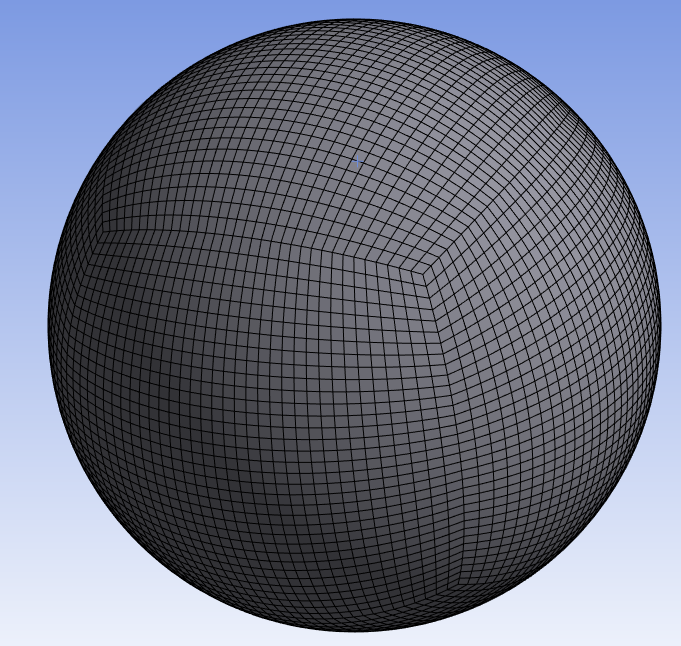

# Spherical Enclosure

**Spherical Enclosure** control automatically creates a spherical enclosure for the input scope with the provided parameters.

**Spherical Enclosure Details** view has the following options:

**General**

* **[Control Type](../controls.md)**

**Scope**

* **[Define By](../controls.md)**
* **[Scoping Method](../controls.md)**

    Only Part can be selected for creating spherical enclosure.

* **[Scoping Pattern](../controls.md)**

**Definition**

* **Define By**: Allows you to define the element size based on value or settings.
  The available options are:
  * **Value**: Defines the element size based on the provided value.

  * **Settings**: Defines the element size based on the settings under
  **Mesh Settings** in the **Steps Details** view.

* **Element Size**: Allows you to provide the element size.

  When **Define By** is **Value**, you can specify the element size.

  When **Define By** is **Settings**, displays the element size calculated 
  based on the provided **Mesh Settings** in the **Steps Details** view. 
  The **Element Size** is read-only.

  You can click   on the right corner 
  of the option and click **Publish** to publish **Element Size** to the **Property Worksheet**.

  You can parameterize **Element Size** only when **Defined By** is **Value**.
  
* **Center Type**: Allows you to define the center of the spherical enclosure.
The default value is **Minimal**.
The available options are:

  * **Minimal**: Uses the center of the minimal enclosure sphere.

  * **Centered**: Uses the center of the bounding box of the model.

  * **User Defined**: Allows you to define the center using the 
  provided location coordinate (X, Y, Z).

* **Mesh Type**: Allows you to provide the type of mesh.
The default value is **Quadrilaterals**.
The available options are: 
  * **Triangles**: Creates mesh with triangular elements.
  * **Quadrilaterals**: Creates mesh with quadrilateral elements.

* **Minimum Absolute Radius**: Allows you to provide the minimum radius
for the spherical enclosure.
The default value is **0.0**.
You can click   on the right corner of 
the option and click **Publish** to publish **Minimum Absolute Radius** to the **Property Worksheet**.
You can parameterize **Minimum Absolute Radius**.

* **Minimum Number of Layers**: Allows you to provide the minimum layers of mesh elements
between the model and the enclosure.
You can parametrize **Minimum Number of Layers**.
The default value is **2**.
You can click   on the right corner of 
the option and click **Publish** to publish **Minimum Number of Layers** to the **Property Worksheet**.

* **Percentage Increment**: Allows you to specify the minimal percentage increment 
of the enclosure dimensions with respect to the model.
The default value is **1.0**.
You can click   on the right corner of the 
option and click **Publish** to publish **Percentage Increment** to the **Property Worksheet**.
