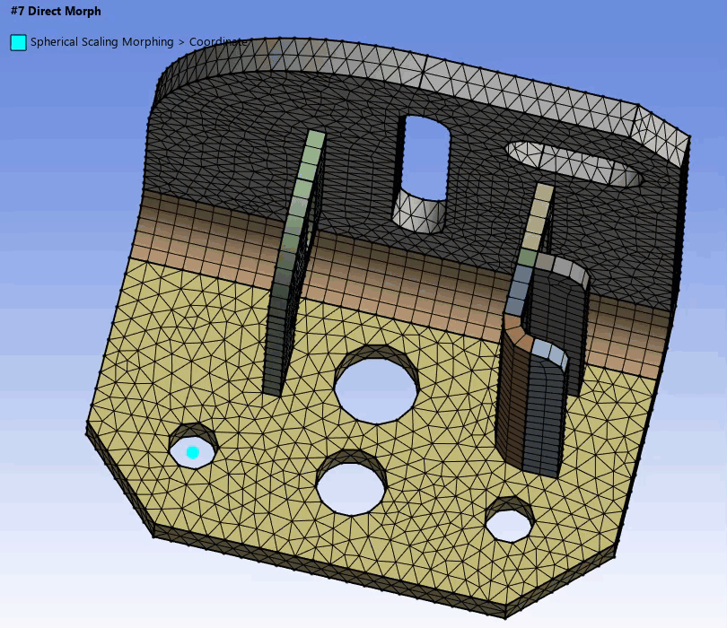

# Spherical Scaling Morphing

**Spherical Scaling Morphing** allows you to scale the selected faces and edges based on the defined centroid and scale factor.
You may create labels for the selected faces and edges and scope the labels for morphing.
 
 

**Spherical Scaling Morphing Details** view has the following options:

**General**

* **Control Type**: Allows you to specify the type of morph control to be used.

**Control Scope**

* **Control Scoping Method**: Allows you to scope the entities where you want 
to prescribe the displacements for morphing.
You can scope **Part** and **Label** entities.

* **Control Scoping Pattern**: Allows you to specify the name pattern to scope 
entities prescribed for displacements while morphing.
 You can click  on the right corner of the 
 option and the following options are available:

   * **Publish**: Publishes **Control Scoping Pattern** to the **Property Worksheet**. 
   * **Scope All**: Inserts '.*' regular expression to scope all entities.

**Fixed Scope**

* **Fixed Scoping Method**: Allows you to scope the entities that you want to 
prescribe as fixed while morphing. You can only scope entities with **Label**.

* **Fixed Scoping Pattern**: Allows you to specify the name pattern to scope entities
 prescribed as fixed while morphing.
 You can click  on the right corner of the 
 option and the following options are available:

   * **Publish**: Publishes **Fixed Scoping Pattern** to the **Property Worksheet**. 
   * **Scope All**: Inserts '.*' regular expression to scope all entities.

**Rigid Scope**

* **Rigid Scoping Method**: Allows you to scope the entities where you want to 
prescribe displacement without any deformation while morphing.
You can only scope entities with **Label**.

* **Rigid Scoping Pattern**:  Allows you to specify the name pattern to scope entities 
that you want to prescribe displacement without any deformation while morphing.
You can click  on the right corner of the 
 option and the following options are available:

   * **Publish**: Publishes **Rigid Scoping Pattern** to the **Property Worksheet**. 
   * **Scope All**: Inserts '.*' regular expression to scope all entities.

**Morphable Scope**

* **Morphable Scoping Method**: Allows you to scope the entities that are allowed to 
morph based on the movements of the control scope.
You can only scope entities with **Label**.

* **Morphable Scoping Pattern**: Allows you to specify the name pattern to scope entities
 that are allowed to morph based on the movements of the control scope.
You can click  on the right corner of the 
 option and the following options are available:

   * **Publish**: Publishes **Morphable Scoping Pattern** to the **Property Worksheet**. 
   * **Scope All**: Inserts '.*' regular expression to scope all entities.

**Definition**

* **Coordinate Define By**: Allows you to define the sphere center for spherical scaling.
 The available options are:
 * **Location**: Allows you to use the coordinates from a picked location to define the 
 sphere center for spherical scaling. You can select any location and click **Apply** 
 in **Coordinate** to get the coordinates of the selected location.

 When **Coordinate Define By** is **Location**, the available option is:
    * **Coordinate**: Allows you to select the location coordinate based on your 
    selection in the **Geometry** window.

 * **Coordinate System**: Allows you to select the defined coordinate systems to 
 define the sphere center for spherical scaling. You can click 
  to select from the 
 available list of coordinate systems that are defined under the **Coordinate Systems**
  object in the **Tree** outline.

 * **Geometry Selection**: Allows you to define the centroid of the selection as the 
 sphere center for spherical scaling.

   * **Coordinate**: Allows you to get the coordinates of centroid of your selection 
   in the **Geometry** window.

* **X Coordinate**: Provides the X coordinate of the sphere center for spherical scaling
 based on the selected **Coordinate Define By** option. You can click 
 on the right corner of the option and click **Publish** to publish **X Coordinate** 
 to the **Property Worksheet**.
 You can parameterize **X Coordinate**.

* **Y Coordinate**: Provides the Y coordinate of the sphere center for spherical scaling 
based on the selected **Coordinate Define By** option.
You can click  on the right corner of 
  the option and click **Publish** to publish **Y Coordinate** to the **Property Worksheet**.
   You can parameterize **Y Coordinate**.

* **Z Coordinate**: Displays the Z coordinate of the sphere center for spherical scaling 
based on the selected **Coordinate Define By** option.
You can click  on the right corner of 
  the option and click **Publish** to publish **Z Coordinate** to the **Property Worksheet**.
   You can parameterize **Z Coordinate**.

* **Scale Factor**: Allows you to provide the factor to scale the scoped entities in the 
spherical coordinate system at the defined sphere center.
 A **Scale Factor** less than 1, shrinks the scoped entities along the defined sphere center.
A **Scale Factor** greater than 1, grows the scoped entities along the defined sphere center.
You can click  on the right corner of 
  the option and click **Publish** to publish **Scale Factor** to the **Property Worksheet**.
   You can parameterize **Scale Factor**.
