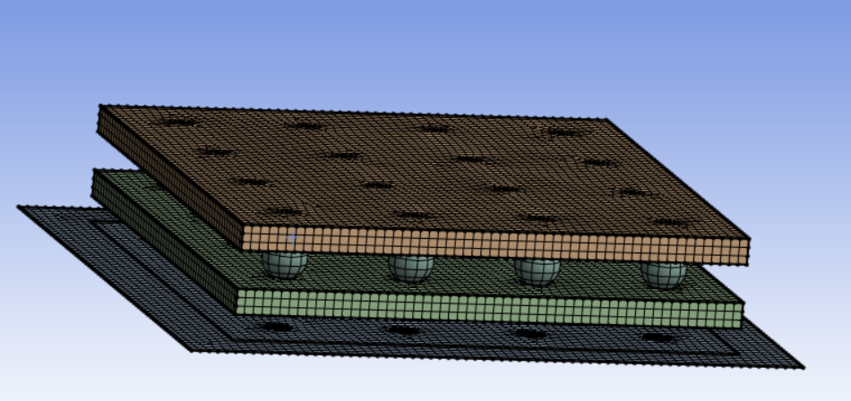

### Stacker: Volume Meshing 

**Stacker: Volume Meshing** creates volume mesh for the scope body from the base face.

**Stacker: Volume Meshing Details** view has the following options:

**General**

* **[Control Type](../controls.md)**: Displays the selected control type.

**Scope**

* **[Define By](../controls.md)**: Allows you to define the input to the selected control.
The available options are **Value** and **Outcome**.

  * **Value**: Allows you to set manually the value of the **Scoping Method** and **Scoping Pattern**.

  * **Outcome**: Allows you to select the existing scoped outcomes from the previous steps as input.

* **[Scoping Method](../controls.md)**: Allows you to select the entities for the selected control.
The available options are:

  * **Part**: Allows you to select parts for defining the scope of the control.

  * **Label**: Allows you to select labels for defining the scope of the control.

  * **Zone**: Allows you to select zones for defining the scope of the control.

* **[Scoping Pattern](../controls.md)**: Allows you to specify the name pattern to get the selected **Scoping Method**.
 **Scoping Pattern** supports **Regular Expression**.You can click  on the right corner of the option and the following options are available:
    * **Publish**: Publishes **Scoping Pattern** to the **Property Worksheet**. 
    * **Scope All**: Inserts '.*' regular expression to scope all entities.

**Definition**

* **[Define By](../controls.md)**: Allows you to define the input to the selected control.
The available options are **Value** and **Outcome**.

  * **Value**: Allows you to set manually the value of the **Scoping Method** and **Scoping Pattern**.

  * **Outcome**: Allows you to select the existing scoped outcomes from the previous steps as input.

* **Stacking Defeature Size**: Allows you to set the tolerance along the stacker direction. **Stacking Defeature Size** defines the tolerance between successive layers. You can click  on the right corner of the option and click **Publish** to publish **Stacking Defeature Size** to the **Property Worksheet**. You can parametrize **Stacking Defeature Size**.

* **Default Offset Size**: Allows you to set the default offset size for the stacker base face. **Default Offset Size** define thickness of layer along stacking direction. You can click  on the right corner of the option and click **Publish** to publish **Default Offset Size** to the **Property Worksheet**. You can parametrize **Default Offset Size**.

* **Conformal Mesh On Contact Surfaces**: Allow you to set the conformal mesh on contact surfaces only for scoped entities of **Stacker: Mesh Volume** operation. when set to **Yes**. The default value is **Yes**.

**Seed Face Scope**
* **[Define By](../controls.md)**: Allows you to define the input to the Seed Face Scoping Method.
The available options are **Value** and **Outcome**.

  * **Value**: Allows you to set manually the value of the **Scoping Method** and **Scoping Pattern**.

  * **Outcome**: Allows you to select the existing scoped outcomes from the previous steps as input.

* **Seed Face Scoping Method**: Allows you to scope the faces outside the input scope whose edges are to be transferred to the base face respected while meshing.
The available options are:

  * **Label**: Allows you to select Labels for defining the seed face scope of the **Stacker: Volume Flattening** control.

  * **Zone**: Allows you to select Zones for defining the scope of the **Stacker: Volume Flattening** control.

* **Stacker: Seed Face Scoping Pattern**: Allows you to specify the name pattern to get the selected **Seed Face Scoping Method**.
 **Stacker: Seed Face Scoping Pattern** supports **Regular Expression**. You can click  on the right corner of the option and the following options are available:
    * **Publish**: Publishes **Stacker: Seed Face Scoping Pattern* to the **Property Worksheet**. 
    * **Scope All**: Inserts '.*' regular expression to scope all entities.

**Base Face Scope**
* **[Define By](../controls.md)**: Allows you to define the input to the **Base Face Scoping Method**.

* **Base Face Scoping Method**: Allows you to scope the base faces for the volume mesh.
The available options are:

  * **Label**: Allows you to select labels for defining the base face scope of the **Stacker: Volume Flattening** control.

  * **Zone**: Allows you to select zones for defining the base face scope of the **Stacker: Volume Flattening** control.

* **Base Face Scoping Pattern**: Allows you to specify the name pattern to get the selected **Base Face Scoping Method**.

  **Base Face Scoping Pattern** supports **Regular Expression**. You can click  on the right corner of the option and the following options are available:
  * **Publish**: Publishes **Stacker: Base Face Scoping Pattern** to the **Property Worksheet**.
  * **Scope All**: Inserts '.*' regular expression to scope all entities.

 