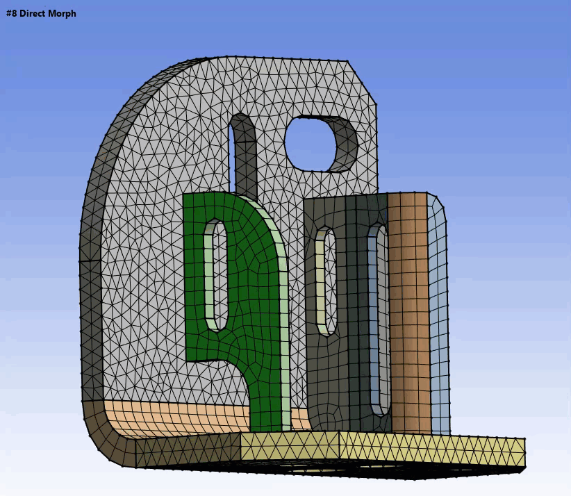
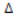

# Translation Morphing

**Translation Morphing** allows you to translate the faces along the 
specified direction with the given displacement.

**Translation Morphing Details** view has the following options:

**General**

* **Control Type**: Allows you to specify the type of morph control to be used.

**Control Scope**

* **Control Scoping Method**: Allows you to scope the entities where you want 
to prescribe the displacements for morphing.
You can scope **Part** and **Label** entities.

* **Control Scoping Pattern**: Allows you to specify the name pattern to scope 
entities prescribed for displacements while morphing.
You can click  on the right corner of the 
option and the following options are available:

   * **Publish**: Publishes **Control Scoping Pattern** to the **Property Worksheet**. 
   * **Scope All**: Inserts '.*' regular expression to scope all entities.

**Fixed Scope**

* **Fixed Scoping Method**: Allows you to scope the entities that you want to 
prescribe as fixed while morphing. You can only scope entities with **Label**.

* **Fixed Scoping Pattern**: Allows you to specify the name pattern to scope entities
 prescribed as fixed while morphing.
 You can click  on the right corner of the 
 option and the following options are available:

   * **Publish**: Publishes **Fixed Scoping Pattern** to the **Property Worksheet**. 
   * **Scope All**: Inserts '.*' regular expression to scope all entities.

**Rigid Scope**

* **Rigid Scoping Method**: Allows you to scope the entities where you want to 
prescribe displacement without any deformation while morphing.
You can only scope entities with **Label**.

* **Rigid Scoping Pattern**: Allows you to specify the name pattern to scope entities 
that you want to prescribe displacement without any deformation while morphing.
You can click  on the right corner of the 
 option and the following options are available:

   * **Publish**: Publishes **Rigid Scoping Pattern** to the **Property Worksheet**. 
   * **Scope All**: Inserts '.*' regular expression to scope all entities.

**Morphable Scope**

* **Morphable Scoping Method**: Allows you to scope the entities that are allowed to 
morph based on the movements of the control scope.
You can only scope entities with **Label**.
* **Morphable Scoping Pattern**: Allows you to specify the name pattern to scope entities
 that are allowed to morph based on the movements of the control scope.
You can click  on the right corner of the 
 option and the following options are available:

   * **Publish**: Publishes **Morphable Scoping Pattern** to the **Property Worksheet**. 
   * **Scope All**: Inserts '.*' regular expression to scope all entities.

> Note:

  **Morphable Scope** is optional. When you do not specify the morphable scope, the morpher automatically uses
  one ring of neighboring faces connected to the control scope as morphable. 

**Definition**

* **X**: Displacement along the X-axis.
You can click 
 on the right corner of the option and click **Publish** to publish **X** to the **Property Worksheet**.
 You can parameterize **X**.

* **Y**: Displacement along the Y-axis.
You can click 
 on the right corner of the option and click **Publish** to publish **Y** to the **Property Worksheet**.
 You can parameterize **Y**.

* **Z**: Displacement along the Z-axis.
You can click 
 on the right corner of the option and click **Publish** to publish **Z** to the **Property Worksheet**.
You can parameterize **Z**.