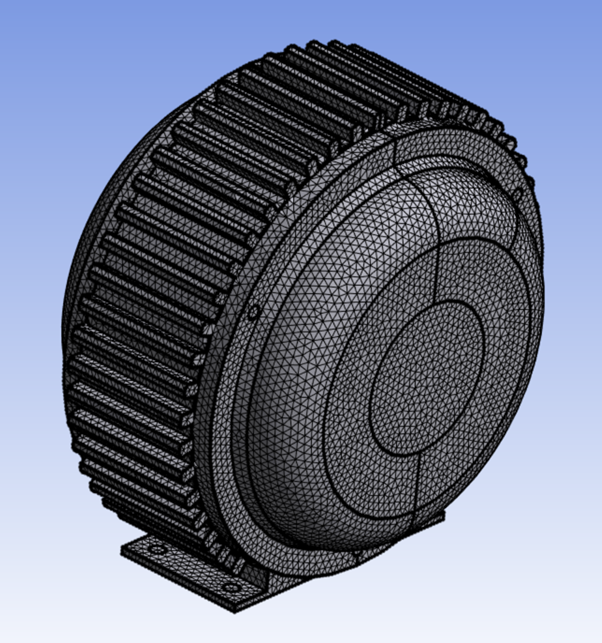

# Wrapper Specific Surface Mesher

**Wrapper Specific Surface Mesher** provides post wrapping improvement operation using surface meshing based on the mesh settings and surface quality measures. For example, you can improve the wrapper generated surface by remeshing based on the current size field and target skewness.
You should use **Wrapper Specific Surface Mesher** only after wrapping.

**Wrapper Specific Surface Mesher Details** view has the following options:

**General**

* **[Control Type](../controls.md)**

**Scope**
* **[Define By](../controls.md)**
* **[Scoping Method](../controls.md)**

    Only **Part** can be selected for surface meshing.

* **[Scoping Pattern](../controls.md)** 

**Definition**

* **Define By**: Allows you to define the element size based on value or settings.
  The available options are:
  * **Value**: Defines the element size based on the provided value.

  * **Settings**: Defines the element size based on the settings under
  **Mesh Settings** in the **Steps Details** view.

* **Element Size**: Provides the element size. 

  **Note**: If you apply size fields for the **Wrapper Specific Surface Mesher**, the **Max Size** specified in the size field takes precedence over the **Element Size**.

  When **Define By** is **Value**, you can specify the element size for surface meshing.

  When **Define By** is **Settings**, displays the element size calculated 
  based on the provided **Mesh Settings** in the **Steps Details** view. 
  The **Element Size** is read-only.

  You can click  on the right corner of the 
  option and click **Publish** to publish **Element Size** to the **Property Worksheet**.
  You can parameterize **Element Size** only when **Defined By** is **Value**.

* **Define Size Field By**: Allows you to define the size field name pattern. 
  The available options are:
  * **Value**: Allows you to provide the size field name pattern manually.
    
  * **Outcome**: Allows you to select the size field from a previous outcome as input.

Note: **Define Size Field By** is available only when you have a **Create Size Field** step defined
      before the **Wrapper Specific Surface Mesh** step.

* **Size Field Name Pattern**: Allows you to specify the name pattern of size fields to be activated.
* **Target Skewness**: Allows you to provide the target skewness to 
improve surface mesh of wrapper part.
The Target Skewness value ranges from **0**(low quality) to **1**(high quality).
The default value is **0.6**.
You can click  on the right corner of the option
and click **Publish** to add **Target Skewness** to the **Property Worksheet**. 
You can parameterize **Target Skewness**.
* **Mesh Type**: Allows you to select the type of mesh you want to generate.
The default value is **Triangles**.
The available options are:
  * **Triangles**: Creates mesh with triangular elements.
  * **Quadrilaterals**: Creates mesh with quadrilateral elements.
* **Delete Mesh Volumes(Beta)**: Allows you to delete the original volumes after meshing when **Delete Mesh Volumes** is **Yes**. The default value is **No**. 
* **Extract Feature Edges**:Allows you to extract the feature edges after remeshing when **Extract Feature Edges** is **Yes**. The default value is**No**.
* **Skewness Limit(Beta)**: Allows you to specify the maximum skewness limit for the the face elements. 
The default value is **0.9**.