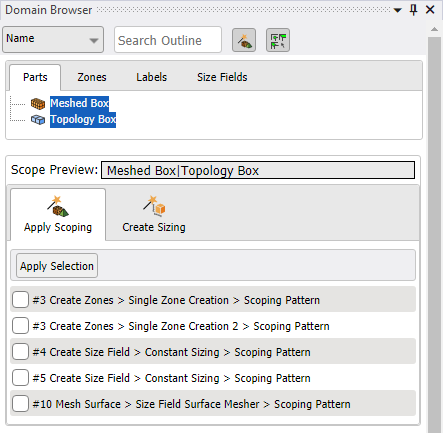

 # Show Wizards

Show Wizards () displays the wizards in the **Domain Browser**. **Domain Browser** has  the following wizards:
* [**Apply Scoping**](../Wizards/ScopingWizard.md): Allows you to scope the entities for scoping patterns displayed in the **Domain Browser**.
* [**Create Sizing**](../Wizards/createsizingwizard.md): Allows you to create size field controls for existing **Create Size Field** steps for the mesh workflow model.

Wizards have the following options:
* **Scope Preview**: Previews the current pattern that is used by the wizards.
If you select some entities (parts, zones, labels or size fields) in the **Domain Browser**, the **Scope Preview** shows a pattern that matches all the selected entities. If you do not select any entities, the **Scope Preview** displays the pattern defined in the **Search Outline** to match the current **Domain Browser** entity filter.

