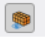
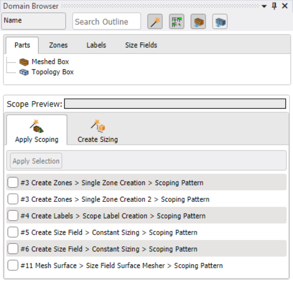
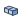
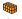
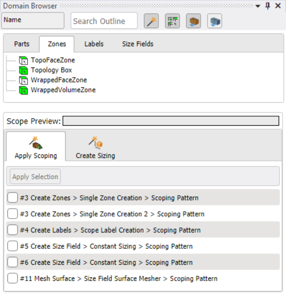
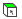
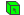
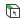
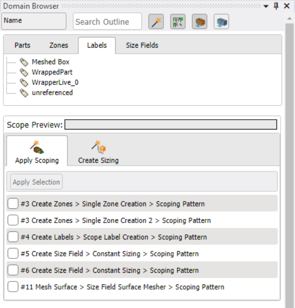
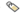

# Domain Browser

**Domain Browser** allows you to view the parts, zones, labels or size fields involved in the mesh workflows and to edit individual controls in mesh workflows.

**Domain Browser** has the following options:

* **Name**: Allows you to search based on the names of parts, zones, labels or size fields.
* **Search Outline**: Allows you filter the entities in the mesh workflow by matching your search criteria. **Search Outline** uses the same regular expression supported in controls.
* : Allows you to enable the wizards to edit and configure the mesh workflow. For information related to Show Wizards, refer to **[Show Wizards](domain_browser/show_wizards.md)**
* : Displays the scoped entities in the Geometry window.
* : Displays the mesh edge tessellation in the Geometry Window.
* : Displays the geometry edge tessellation in the Geometry Window.

* **Parts**: Displays the parts in the mesh workflows. In **Domain Browser**, **Parts** tab have the following icons:

: Denotes the parts with topology.

: Denotes the parts without topology.

* **Zones**: Displays the zones in the mesh workflows. In **Domain Browser**, **Zones** tab have the following icons:

    

    : Denotes the surface or face zones in the **Mesh Workflow**.

    : Denotes the volume zones in the **Mesh Workflow**.

    : Denotes the edge zones in the **Mesh Workflow**.

* **Labels**: Displays the labels in the mesh workflows.
  **Labels** are groups of entities that you use in various mesh workflow operations.
    When you initialize a workflow, the named selections in the imported geometry become **Labels** in the **Mesh Workflow**.
    In **Domain Browser**, **Labels** tab have the following icon:

    

    : Denotes the labels in the **Mesh Workflow**.

* **Size Fields**: Displays the size fields in the mesh workflows. In **Domain Browser**, 
  **Size Fields** tab have the following icon:

    

    : Denotes the size fields in the **Mesh Workflow**.

Right-click options available when you click on parts, zones, labels or size fields:
* **Select All**: Allows you to select all the entities.
* **Unselect All**: Allows you to unselect all the entities.
