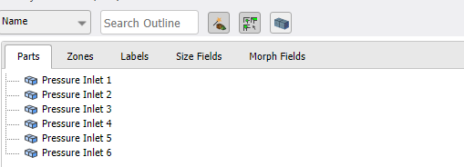
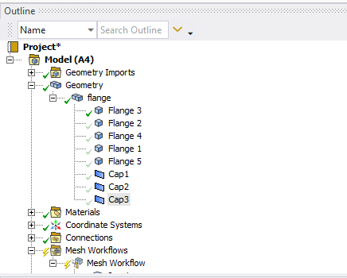
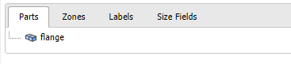
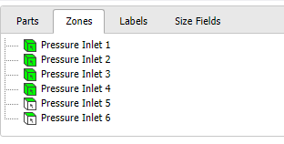
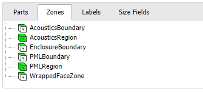
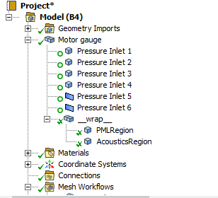
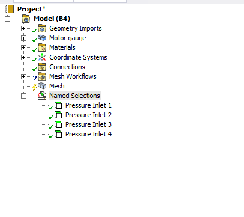
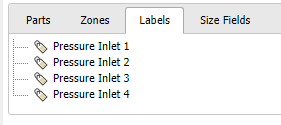

# Mesh Workflow Concepts

**Mesh Workflows** define a new meshing framework exposing advanced meshing capabilities to **Ansys Mechanical** for dealing with complex CAD geometries and meshing procedures. In **Mesh Workflows**, a meshing procedure is modelled as a sequence of **Steps** (a workflow) that can be parameterized and interconnected through the concepts of **Controls** and **Outcomes**.

## Controls
**Controls** define the inputs for each workflow step, exposing the underlying algorithm parameters, and defining the input scope for the step.

## Outcomes
**Outcomes** expose the output data for each workflow step, expose information about the underlying algorithm execution like failure information and the generated mesh data as output scopes.

## Steps
**Mesh Workflow Steps** operate on a new computational domain called the **PrimeMesh** model, based on the PrimeMesh meshing kernel which exposes new meshing capabilities to **Ansys Mechanical**.

## PrimeMesh Model
The PrimeMesh model eases mesh generation in the following ways:

* Provides a lightweight simulation geometry that operates independently of the CAD constraints.

* Allows geometry modifications and manipulations that are often difficult to achieve with CAD systems.

* Operates differently from CAD-based systems and allows the creation of volumes without a CAD body.

* Uses wrapper approaches or surface and edge-based tools to create closed volumes for volume meshing, eliminating the need for boolean operations, which often fail with complex geometry.

A **PrimeMesh** model can be initialized by transferring the desired geometry from **Mechanical** to the **Mesh Workflows** using the exposed **Input** object.

In the **Mesh Workflows**, all entities under a **Mechanical** part, including solid bodies, sheet bodies, line bodies, surfaces, curves, and vertices get converted to corresponding PrimeMesh topological entities.

PrimeMesh topological entities are simplified, faceted versions of the original geometry and mesher keeps the original detailed geometry as a reference.

In the PrimeMesh Model, you can perform various operations to interact with the PrimeMesh topology, allowing flexible changes that are difficult to achieve in a CAD system. These operations include creating tolerant edge-based connections and merging complex surfaces or edges without losing the original shape.

When all **Mesh Workflow Steps** are completed, the resulting **PrimeMesh** model can be transferred to the **Mechanical Mesh** by completing the **Output** object. On completion, the underlying **PrimeMesh** model is translated to the corresponding **Mechanical** entities as a set of geometry bodies, mesh parts and named selections.

> Note: Each **Mesh Workflow** operates on a separate **PrimeMesh** model, as no data is shared between multiple workflows.

The **PrimeMesh** model computational domain has:
* **Parts**: Refers the topology and mesh data of the model. When **PrimeMesh** consumes a **Mechanical** Part, it forms a **PrimeMesh** Part for each component.
  
  The following image shows the multiple parts in **Mechanical** and **PrimeMesh**

     
  >Note: **PrimeMesh** Parts are independent of each other, and do not share any data with other Parts.

 The following image shows the multibody part with shared topology in **Mechanical** and **PrimeMesh**:

  

  >Note : In multibody parts, bodies with shared topology in **Mechanical** creates a single part in **PrimeMesh**.

  For example, in the **Wrap** Step ,You can delete the original part from the CAD in **Mesh Workflow** after creating a representation better suited for simulation. In some cases, this approach saves significant time and effort compared to cleaning up CAD and creating closed volumes by connecting and refining surface topologies.
  When meshing the **PrimeMesh** model **Parts**, **PrimeMesh** needs to collect the generated mesh entities to propagate them to output back into Mechanical entities, such as geometric entities like solid or sheet bodies, or **Named Selection** groups of Faces or Bodies.
* **Zones**: Represents a group of complete topological or mesh entities that define a complete partitioning of a part. Each zone has entities with same dimension such as **Volume Zones** (3D), **Face Zones**(2D) and **Edge Zones** (1D), and has one-to-many mapping like one entity can belong to a single zone but one zone can consist of multiple entities. For its non-overlapping property, **Zones** can be used for assigning material property and boundary condition.
  The following image shows the multibody part in **Mechanical** transfers in to zones in **PrimeMesh**:

       
   > Note:  Mesh entities create a unique partition of the domain, so they do not overlap. For example, mesh elements (like hexes or tets) cannot appear in multiple **Volume Zones**, and mesh faces (like quads or tris) cannot appear in multiple **Face Zones**.

  The following image shows the volume zones in **PrimeMesh** transfer to solid bodies in **Mechanical**

   
* **Labels**:  Represents a named grouping of entities. You can  apply these labels for meshing operations and to determine which surfaces appear during the transfer to the Mesh Folder.
 The following image shows the **Named Selections** in **Mechanical** and **Labels** in **PrimeMesh**

 |Mechanical     | PrimeMesh      | Description and Differences  |
| -------------|  ------------- |------------- |
|Parts  |  Parts | Compared to **Mechanical** Parts which are consisting of geometry bodies, **PrimeMesh** Parts can either consist of topology entities created from imported CAD parts or contain mesh entities created from faceted geometries and/or imported meshes.
| Solid Body  | Volume Zone  | Each solid body becomes a topological volume in the **PrimeMesh** model once initialized. You can define Volume Zones with multiple topological volumes for property assignment. Volume Zones transfer to **Mechanical** as solid bodies.
| Sheet Body  |Face Zone |Face Zone is a collection of topological faces or a group of interconnected mesh faces. Face Zones  transfer to **Mechanical** as surface bodies.
| Line Body  |  Edge Zone  | Edge Zone is a collection of topological edges or a group of interconnected mesh edges. Edge Zones transfer to **Mechanical** as line bodies.
| Named Selections  | Labels   | Labels are  names associated to entities. Compared to **Named selections** in **Mechanical**, **Labels** do *not* have a state and can appear or disappear at any time. At mesh workflow initialization time, **Named Selections** are propagated as **Labels** in the **PrimeMesh** model.

