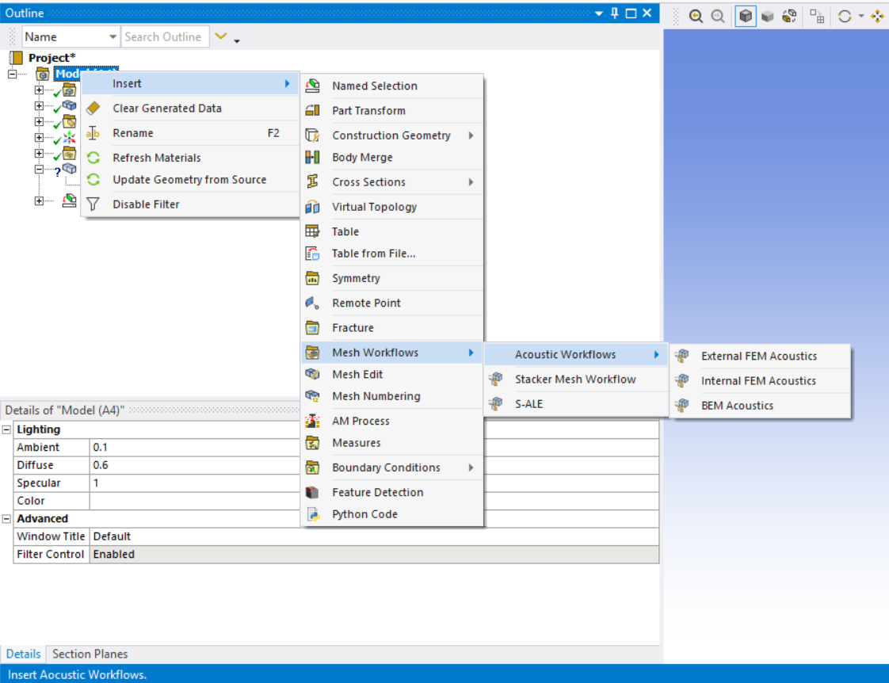
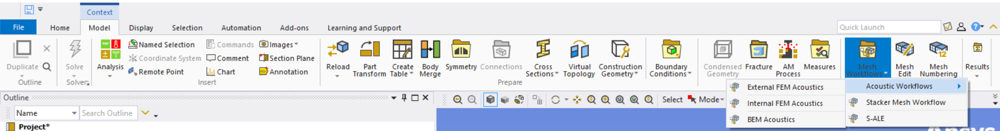
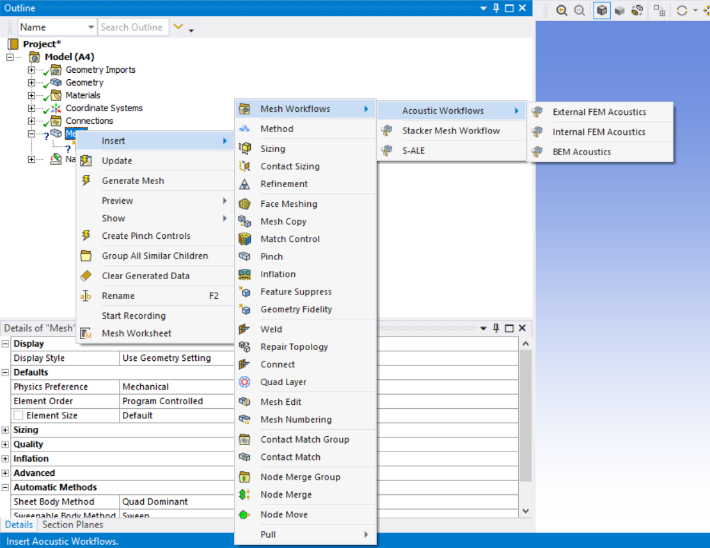
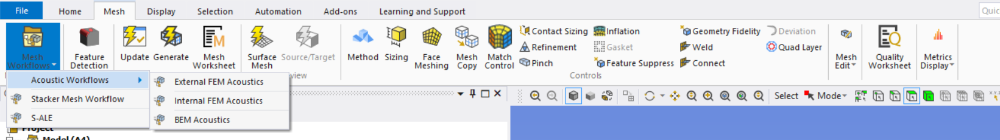
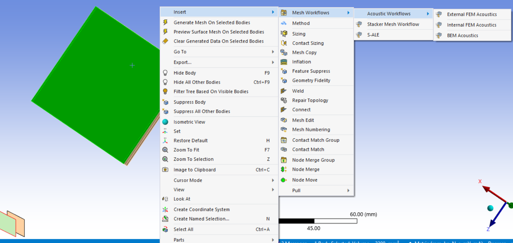

# Mesh Workflows Introduction

**Mesh Workflows** offer a workflow-based approach for mesh generation of specific needs and support the use of predefined templates which can be customized as needed. Each **Mesh Workflow** consists of a series of steps which define the mesh generated, and each specific step in the workflow is based on a generic operation of a certain type. The **Controls** of an operation define what-to-do and how-to-do and provide a flexible composition of meshing algorithms and the **Outcomes** capture the results of an operation.

To access **Mesh Workflows**,

1. On the **Tree** Outline, right-click **Model** and click **Insert > Mesh Workflows**.

2. Select **Mesh Workflow Type** as per your requirement.

or

1. On the **Tree** Outline, click **Model**.

2. In the **Model Context** tab, under the **Mesh** group, click **Mesh Workflows** and select the **Mesh Workflow Type**.

or

1. On the **Tree** Outline, right-click **Mesh** and click **Insert > Mesh Workflows**.

2. Select the **Mesh Workflow Type** as per your requirement.

or

1. On the **Tree** Outline, click **Mesh**.

2. In the **Mesh Context** tab, under the **Mesh Workflows** group, click **Mesh Workflows** and select the desired **Mesh Workflow Type**.

or

1. Right-click on the **Geometry** window, click **Insert** >  **Mesh Workflows**.

2. Select **Mesh Workflow Type** as per your requirement.
  

When you select a **Mesh Workflow Type**, a **Mesh Workflows** object is created on the tree. When you click the **Mesh Workflows** object on the **Tree**, the **Mesh Workflows Details** view and the [Mesh Workflows Context](mesh_workflow_context_tab.md) tab are displayed.

**Mesh Workflows** object has a **Mesh Workflow** child-object of the selected **Mesh Workflow Type**. **Mesh Workflow** child-object has a predefined workflow based on the selected **Mesh Workflow Type**. You can select the created **Mesh Workflow** child-object to display the Details view of the corresponding [Mesh Workflow](../meshworkflow.md) child-object and its associated **Property Worksheet**.

The **Mesh Workflows Details** view has the following options:

**Definition**

* **Active Workflow Group**: Displays the active workflow type used for generating mesh.

> **Note**:  Mesh object parameters in the Details view do not have any impact on the Mesh Workflow parameters.

Right-click options available in **Mesh Workflows** are:

* **Insert**: Allows you to insert the desired mesh workflow type.

* **Delete**: Allows you to delete the respective mesh workflows.

* **Clear Generated Data**: Allows you to reset the generated data for the selected mesh workflow.

* **Clear Output Data**: Allows you to clear the output data after completing the mesh workflow. **Clear Output Data** is available only after completing the mesh workflow.

* **Generate Mesh Workflows**: Allows you to generate the selected mesh workflow.