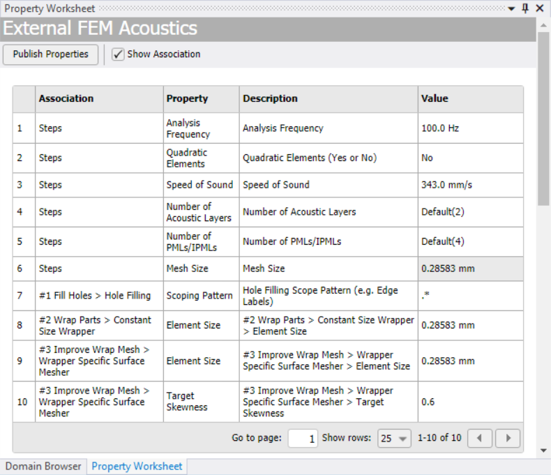

# Property Worksheet

The **Property Worksheet** allows you to view the published properties of each control involved in mesh workflows and the Settings defined in the **Steps Detail** View, and to edit individual controls. Also, displays the default published properties for the respective Mesh Workflow.
The **Property Worksheet** provides an easy visualization of the input options for mesh workflows and to edit individual controls.

**Property Worksheet** has the following options:

* **Publish Properties**: Allows you to add the unpublished properties for the selected controls or selected steps on the tree outline.
You can select the checkbox of a respective step or control and click **Publish** to add it to the **Property Worksheet**.
* **Show Association**: Enables or disables the **Association** and **Property** column in the **Property Worksheet**. You can select the checkbox to enable **Association** and **Property** columns in the **Property Worksheet**.

* **Association**: Displays the path of the step, control or outcome that uses the published property.
* **Property**: Displays the options that published from the Details view or **Publish Properties** in the **Property Worksheet**.

* **Description**: Displays a description that explains the function of the property. You can click the text area to edit and enter a custom description. If you do not provide a custom description, the **Property Worksheet** automatically shows the default path of the step, control, or outcome associated with the property.
* **Value**: Displays the values of the property. You can edit the value for the property from the worksheet for each control without accessing the individual control type.

    You can hover over the **Property Worksheet** options and click the dropdown to sort or filter the option in the worksheet as per your requirement.
     **Value** does not have the sorting and filtering options. To reload or refresh the **Property Worksheet**, right-click anywhere in the **Property Worksheet** and click **Reload**.

* **Go to page**: Allows you to navigate to the specified page.
* **Show rows**: Allows you to specify the number of rows to be displayed on a page.
*  : Allows you to navigate to the previous page in the mesh workflow worksheet.
*  : Allows you to navigate to the next page in the mesh workflow worksheet.

Right-click options available in the worksheet are:

* **Unpublish**: Removes the selected row from the **Property Worksheet**.
* **Go To Object**: Allows you to view the selected control on the tree outline.
* **Define By Settings**: Allows you to set the property to be defined by settings. **Define by Settings** applies to all applicable properties in the selected properties control and updating their values with corresponding values in the **Settings** as defined in the **Steps Details** view. **Define By Settings** is available only for the properties defined by the settings in the **Steps Details View**.
* **Define By Value**: Allows you to define the value for the published property from the **Property Worksheet**. **Define By Value** is available only for the properties defined by the settings in the **Steps Details View**.