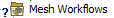
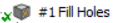
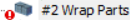

# Mesh Workflow States

**Mesh Workflow States** enable you to understand the states of workflows,
steps and other related **Mesh Workflows** objects.
**Mesh Workflow States** help you to handle the problems
occurring while working with **Mesh Workflows**.

Mesh Workflows object, its child-objects and controls have states 
that are defined based on the data propagated in the mesh workflow.
The States propagate up in the object  hierarchy.
The parent object gets the most relevant child object state. 
This helps you to navigate to the issues quickly and resolve it. 

Mesh Workflows objects and controls have the following states:

A check mark  denotes 
that a control is fully defined, or an operation has been executed successfully.

A check mark with a hash  denotes 
a step  is completed and is reversible after execution.

A question mark  denotes 
that the required input is not available.
You may need to:
* define the scope 
* set parameters 
* wait for an Outcome from the previous operation

A lightning bolt  denotes 
that an operation is ready to be executed or that an Outcome is not ready yet.

A red exclamation mark  denotes 
that the operation is blocked due to an error during execution.

Mesh Workflow Objects and Controls states with examples are as follows:
| Symbol | Status                           | Description                                                               |
|--------|----------------------------------|---------------------------------------------------------------------------|
|     | Requires input |  Indicates that the Mesh Workflows requires input and is waiting for outcomes from the operations. |
|  | Fully defined  or   executed successfully                         |      Indicates that the input is fully defined and initialized the workflow successfully.                                                                    |
|        |         Ready to be executed      or Outcome is not ready                   |      Indicates that the input is scoped and is ready for initializing workflow                                                                     |
|            |         Completed the operation and the operation is reversible                         |     Indicates the Fill Holes operation is successfully executed and you can revert the operation.                                                                     |
|        |  Blocked the operation due to an error                                 |     Indicates that the wrap operation is blocked during execution due to  an error.                                                                      |

Refer to [Understanding the States of Mesh Workflows](states/understanding_the_states_of_mesh_workflows.md) for details about how the Mesh Workflow states evolve while setting up and executing a workflow.