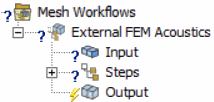
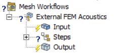
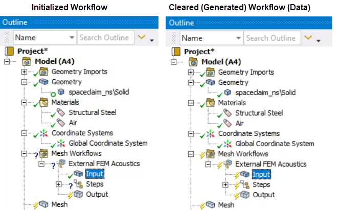
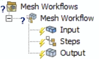
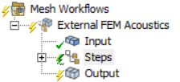
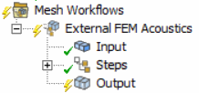
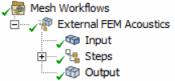

# Understanding the States of Mesh Workflows

When your **Mesh Workflows** are inserted from a predefined workflow type or have an under-defined input,
the **Mesh Workflows** and the **Input** objects are preceded by a question mark to indicate the mesh
workflow is under-defined and requires input data:

When you have not initialized **Mesh Workflow** (that is, input geometry is 
scoped or defined but not transferred), **Mesh Workflows**  is preceded by question mark and the **Input** object
is preceded by a lightning bolt to indicate the mesh workflow requires action:

>**Note**: When you scope the input geometry and initialize the workflow,
the original body is marked as inactive using a circle symbol under 
the **Geometry** object as shown below.
You are not allowed to scope this body for meshing using other **Mesh Methods** or **Mesh Workflow** objects.
The circle symbol also indicates an inactive body that does not participate in other mesh workflows.  
>  
> You may view the following changes:
> * **Suppressed** in the Details view becomes read-only and Parameterization applied on bodies are removed.
> * Geometry window does not display the inactive bodies when you select any of the bodies under Geometry object in the Tree Outline.

When your mesh workflow contains no **Mesh Workflow Steps**, 
the **Mesh Workflows** and its child-objects are preceded by 
a question mark to indicate the **Mesh Workflow Type** is under-defined, 
whereas the **Input** object is preceded by a lightning bolt to indicate
the input geometry is scoped or defined but not transferred:

When your mesh workflow is initialized, the **Input** object is preceded 
by a check mark to indicate the input geometry is fully transferred. 
Additionally, when some of the workflow steps are in the process of being 
executed, the **Steps** object is preceded by a green lightening bolt to 
indicate that the steps execution is in progress:

When your mesh workflow is initialized, the **Input** object is preceded 
by a check mark to indicate the input geometry is fully transferred. 
In addition, when your workflow steps are fully executed, the **Steps** 
object is preceded by a check mark to indicate that the workflow generated data is ready for output:

When your mesh workflow is completed, the **Mesh Workflows** and all its child-objects 
including **Output** object are preceded by a check mark to indicate the workflow generated 
data is fully transferred to **Mesh** and **Geometry** object respectively.

> **Note**: A new body is created under the **Geometry** object after generating the **Output**, 
the created body might be preceded by a question mark to indicate the geometry is 
under-defined (for instance, there is no materials assigned to the zone properties).
