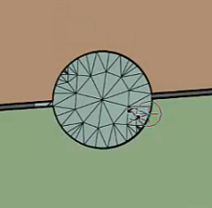

# Patch Holes
The **Patch Holes** operation allows you to create patching surfaces for regions identified using the **Material Points** and **Hole Patching** control properties.
>Note: You can use **Patch Holes** operation when closed edge loops are not available to perform **Fill Holes** operation.

 

The **Patch Holes** operation  has the following controls:

* **[Hole Patching](../controls/hole_patching.md)**: Allows you to patch holes in the model to close the volume defined by the provided Include and Exclude material points in the Material Point control.
* **[Material Point](../controls/material_point.md)**: Defines a coordinate point in a specific region that helps the mesher to identify the region of interest for performing the operation.

>Note: The default material point is **Include**.

* **[Checkpoint](../controls/checkpoint.md)**: Provides a revert option that allows you to revert the **Patch Holes** operation

The **Patch Holes** operation has the following outcome:

* **[Scope](../outcomes/scope.md)**: Allows you to scope the created labels of the **Patch Holes** operation.

