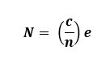
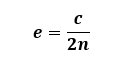

# Mesh Workflow Types

Mesh Workflow Types have predefined workflow templates to perform mesh operations specific that can be customized as per your requirement. Each Mesh Workflow Type has Steps to perform specific operation using Controls and Outcomes. Mesh Workflow Types available are:

- [External FEM Acoustics](types/external_fem_acoustics.md)
- [Internal FEM Acoustics](types/internal_fem_acoustics.md)
- [FSI FEM Acoustics](types/fsi_fem_acoustics_multibodies.md)
- [BEM Acoustics](types/bem_acoustics.md)
- [Stacker Workflow](../mesh_workflows/types/stacker.md)
- [Direct Morphing](types/direct_morphing.md)

## Sizing Recommendations for Acoustic Workflows

In **Acoustics Mesh Workflows**, the number of elements required within a wavelength depends on the desired frequency and required accuracy. You may need at least two or more elements per wavelength to capture the acoustic behaviour efficiently.

## Number of elements per wavelength
The number of elements per wavelength is calculated as:

where,

N is the Number of Elements per Wavelength

c is the Propagation speed of sound

n is the Frequency of Interest

e is the Element Size

Hence, if you want two elements (N=2) per wavelength,you need to set the element size as:

The speed of sound depends on the medium of transmission. The speed of sound is 343 m/s in air at 20°C and 1481 m/s in water at 20°C.

## Guidelines
Guidelines related to Acoustics domain size and Acoustics mesh size

Followed while working with Acoustic workflows are below:

* Domain size should be equal to wavelength (Without PML/IPML). Domain size can be smaller with PML/IPML.

* Mesh size is dependent on speed of sound, Wavelength and Number of Elements in the Wavelength.

* Recommend you to consider the following number of elements in acoustic domain:

    * Number of lower order elements should be greater than or equal to 12 in acoustic domains.

    * Number of higher order elements should be greater than or equal to 6.

    * Number of PML/IPML elements should be greater than or equal to 4.

    * Add buffer elements greater than or equal 2 that are required as a part of acoustic domain.

    For example, if you are working on sound propagation for at 5000 Hz frequency in Air domain with speed of sound as 343000 mm/s.

    Acoustics Domain Size = 343000/5000 = 68.6 mm.

    For Lower order mesh, Element Size for Acoustics and PML/IPML Mesh = 68.6/12 = 5.7167 mm.

    For Higher order mesh, Element Size for Acoustics and PML/IPML Mesh = 68.6/06 = 11.4333 mm.

## Meshing recommendations for Stacker Workflow

* Define a suitable stacking direction when setting up the model.
* Define Named Selections before transferring the model to the Workflow. If any labels are missing, use **[Create Labels](../mesh_workflows/steps/create_labels.md)** operation while executing the Workflow to generate them.

* Non-Stackable bodies in the model can be scoped to [MultiZone Mesh Volume](../mesh_workflows/steps/MultiZone_Mesh_Volume.md).
* You can view the bodies being stacked along the stacking direction to obtain a 2D view, preferably a wireframe view to determine Lateral Defeature Size in complex cases, and you can identify the smallest edge or thinnest gap that needs to be resolved.

* Seed Mesh does not support any split lines that intersect the Seed Mesh when projected onto the base face.
* Seed Mesh does not support cases where overlapping seed meshes along the stacking direction are not identical.
* Stacker may not preserve name selections created on overlapping faces when transferring them to the Workflow.
* You can use the Create Label operation of the workflow to generate face labels.
These labels help to define the faces for the Merge Nodes operation when a conformal mesh is required between overlapping faces.

* Set Quad Layer controls on circular features or set the curvature angle to 30&deg; or smaller to capture the feature better.
* Set the Lateral Tolerance value to less than the smallest edge length to avoid edge collapse.
* Stacking Tolerance only affects sizes along the stacking direction
* Set the  Stacking Tolerance value less than the thinnest layer to avoid the merge with the neighboring layer.
* You can get conformal Mesh by setting **Conformal Mesh on Contact Surfaces** to **Yes** for stacker scoped bodies. Only Multizone scoped bodies need Share Topology to get conformal Mesh.
* You need to update **Growth Rate** to 1.2 from Default Value for better mesh flow for Electronics Components.
* You can control the sizing on edges and faces parallel to the base face by applying sizing controls to the corresponding edges and faces on the base face, using the transferred labels with the prefix BaseFace_.
  
* For Large and Complex Model having dissimilar imprints:

  * Group the layers having Identical Imprints 

  * Define bonded contact between the grouped parts to ensure connectivity..
  * If the Stacker does not work with the lateral defeature size and Stacking Defeature Size, you can set both tolerances slightly below the Global Minimum Edge Length.
  * If model still fails, Debug with Error locations for failed step.

