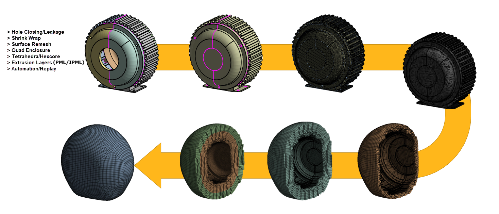

# External FEM Acoustics

**External FEM Acoustics** workflow creates external acoustic sound radiation domain
to predict the propagation of radiated sound in the near field and far field due to
vibration of the external surface of the structural assembly
or flow source port of the fluid flow.

**External FEM Acoustics** workflow can create different domain shape as per your requirement.
The available options are Convex Irregular Shape Enclosure (Irregular Body Fitted Convex),
External Part Enclosure (custom domain shape through imported CAD file), 
Spherical Enclosure, Hemispherical Enclosure. 
All mesh domains have the option to create near field acoustic domain mesh
which is enough for radiation or infinite element boundary condition.
You also have the option to add Perfectly Matched Layers(PML/IPML) to define PML boundary condition.

When you select **Mesh Workflows** as **External FEM Acoustics**, **Mesh Workflow** 
loads a predefined template with **Steps** and **Outcomes**.
**Mesh Workflow** performs the **Steps** through **Controls** and 
**Outcomes** to achieve the desired mesh for the **External FEM Acoustics**.

**External FEM Acoustics** workflow performs the following steps:

- [Fill Holes](../steps/fill_holes.md): Fill the holes defined in the Hole Filling  step.
  The operation type available for **Fill Holes** is **Fill holes**.
  >**Note**: You can add or delete **Fill Holes** as per your requirement.

>**Note**: You can insert **Create Size Field** operation to create size field as per your requirement before **Wrap** operation.

- [Wrap Parts](../steps/wrap.md): Wraps the selected parts.
  The operation type available for **Wrap Parts** is **Wrap**.

- [Improve Wrap Mesh](../steps/mesh_surface.md): Improves the surface mesh.
  The operation type available for **Improve Wrap Mesh** is **Mesh Surface**.

- [Create Enclosure](../steps/create_enclosure.md): Creates the enclosure around the specified scope.
  The operation type available for **Create Enclosure** is **Create Enclosure**.

- [Mesh Volume](../steps/volume_mesher.md): Creates the volumetric mesh.
  The operation type available for **Mesh Volume** is **Mesh Volume**.

- [Improve Volume Mesh](../steps/improve_volume_mesh.md): Improves the volumetric mesh generated in the **Mesh Volume** step.
  The operation type available for **Improve Volume Mesh** is **Improve Volume Mesh**.
    >**Note**: You can add or delete **Improve Volume Mesh** as per your requirement.

- [Extrude Acoustic Region](../steps/extrude.md): Generates layers of prismatic elements from the input surface to a specified height. The generated volume may have layers of constant size hexahedral or triangular prism elements depending on the input surface.
  The operation type available for **Extrude Acoustic Region** is **Extrude**.
    >**Note**: You can add or delete **Extrude Acoustic Region** as per your requirement.

- [Extrude PML/IPML Region](../steps/extrude.md): Generates layers of prismatic elements from the acoustic region to a specified height. The generated volume may have layers of constant size hexahedral or triangular prism elements depending on the input surface.
   The operation type available for **Extrude PML/IPML Region** is **Extrude**.
  >**Note**: You can add or delete **Extrude PML/IPML Region** as per your requirement.  You can create PML/IPML layers extruding the external surface layer based on the **Number of Layers** and **Per Layer Height** you specify.

- [Create Acoustic Regions](../steps/create_topology.md): Creates the topology from the mesh only model.
   The operation type available for **Create Acoustic Regions** is **Create Topology**.

- [Merge Acoustic Regions](../steps/merge_volumes.md): Merges the volume.
  The operation type available for **Merge Acoustic Regions** is **Merge Volumes**.
  >**Note**: You can add or delete **Merge Acoustic Regions** as per your requirement.
- [Assign Physics Properties](../steps/manage_zone_properties.md): Defines material properties and thickness on the scoped parts or zones.
    The operation type available for **Assign Physics Properties** is **Manage Zone Properties**.
  >**Note**: You can add or delete **Assign Physics Properties** as per your requirement.

**<u>Points to Remember</u>**

[Sizing Recommendations for Acoustic Workflows](../types.md#Sizing_Recommendations_for_Acoustic_Workflows)

