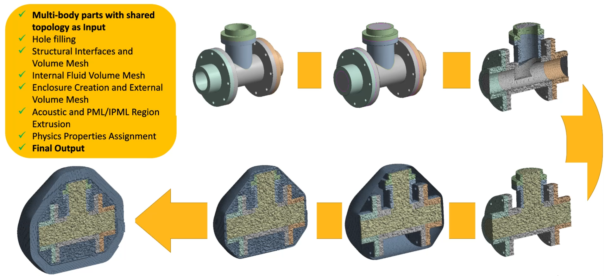

# FSI FEM Acoustics 
 
**FSI FEM Acoustics** workflow creates acoustic domains 
for meshing multibodies in fluid structure interaction analysis.
**FSI FEM Acoustics** Workflow generates mesh on the Structural and Acoustics Domain 
having shared nodes between both domains. In such cases, **FSI FEM Acoustics** workflow
helps you improve solver performance and ensures accuracy of load transfer across 
structures to fluids. In most cases, acoustic domain exists on both sides 
(inside and outside) of the structural body, and you require volume mesh to 
represent the acoustic domains. 
**FSI FEM Acoustics** Workflow offers pre-defined steps to ease the process of mesh creation.

When you select **Mesh Workflows** as **FSI FEM Acoustics**, 
**Mesh Workflow** loads a predefined template with **Steps** and **Outcomes**.
**Mesh Workflow** performs these **Steps** through **Controls** and
**Outcomes** to achieve the desired mesh for the **FSI FEM Acoustics**.

**FSI FEM Acoustics** workflow has the following steps:

- [Initial Model Diagnostics](../steps/model_diagnostics.md)

- [Fill Holes](../steps/fill_holes.md)

- [Auto Repair Topology](../steps/auto_repair_topology.md)

- [Repaired Model Diagnostics](../steps/model_diagnostics.md)

- [Mesh Structural Faces](../steps/mesh_surface.md)

- [Mesh Structural Volumes](../steps/mesh_volume.md)

- [Mesh Internal Fluid Volumes](../steps/mesh_volume.md)

- [Remove Topology](../controls/topology_deletion.md)

- [Create Enclosure](../steps/create_enclosure.md)

- [Mesh External Volume](../steps/mesh_volume.md)

- [Improve Volume Mesh](../steps/improve_volume_mesh.md)

- [Extrude Acoustic Region](../steps/extrude.md)

- [Extrude PML/IPML Region](../steps/extrude.md)

- [Create Acoustic Regions](../steps/build_topology.md)

- [Merge Acoustic Regions](../steps/merge_volumes.md)

- [Assign Physics Properties](../steps/manage_zone_properties.md  )

>**Note**: Some operation can be added or deleted based on the selected mesh workflow type.

**<u>Points to Remember</u>**

## Recommendations for FSI FEM Acoustics Workflows

When you provide an input to FSI FEM Acoustics Workflow, ensure the following:

* Set the facet quality to 7 before importing model into Mechanical. 
  You can set the facet quality in **Design Modeler** by 
  navigating through **SpaceClaim > SpaceClaim Options > Rendering Quality**. 
  The facet quality in **Design Modeler** can be set by navigating through
  **DesignModeler > Tools > Options > Graphics > Facet Quality.**

* For bodies with large cylindrical faces, a facet quality of 10 may be required 
  for adequate geometric representation during meshing. To avoid rendering the whole model
  with this value, you can set this value on each body using Body Properties 
  in **SpaceClaim** or under **Appearance** in **Discovery**.

* Remove overhangs in upstream CAD. Overhangs are small penetrations between two surfaces. 
  Overhangs can lead to mesh failure or mesh quality issues if they are not resloved.

* If the model has faces with missing facets, then you should fix them in upstream CAD.

* Multi-body parts should be connected with share topology at CAD levels.

* Multi-body parts should not have interfering bodies.

Best Practices:

Some of the best practices to be followed while meshing with FSI FEM Acoustics workflow are:

* Repair tolerance should be set below 10% of global min size to avoid 
  collapsing edges of faces causing incomplete or missing boundaries.

* Surface mesh with intersecting or overlapping faces should be
  resolved before generating volume mesh. 
  Use **Improve Surface Mesh** operation to resolve self-intersections. 

* Ensure that small gaps or clearances are not present in the connected parts. As generating a volume mesh for internal fluid regions may fail if small gaps or clearances are present in the connected parts while performing volume extraction from closed regions.