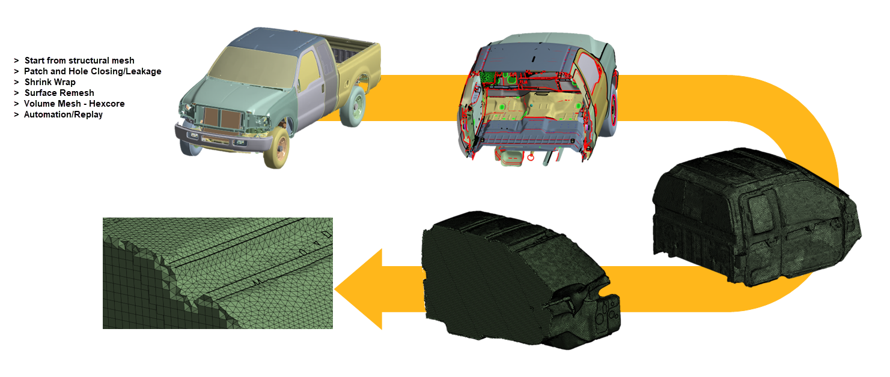

# Internal FEM Acoustics

**Internal FEM Acoustics** workflow creates acoustic domain for internal cavity
acoustic wave propagation and transmission.
The workflow contains steps to close the openings (holes) on the external surface
and create a watertight acoustic cavity.
**Internal FEM Acoustics** workflow meshes the surface cavity with triangular elements
followed by volumetric meshing adjacent to the surface of the cavity.
You can generate Hybrid mesh using hexcore for volumetric meshing.
This helps to reduce the total mesh count if needed.

>**Note**: **Internal FEM Acoustics** recommends a minimum of 12 elements per 
wavelength for FEM mesh having linear elements and a minimum
6 elements per wavelength of sonic speed of medium for quadratic elements.

When you select **Mesh Workflows** as **Internal FEM Acoustics**, 
**Mesh Workflow** loads a predefined template with **Steps** and **Outcomes**.
**Mesh Workflow** performs these **Steps** through **Controls** and
**Outcomes** to achieve the desired mesh for the **Internal FEM Acoustics**.

**Internal FEM Acoustics** workflow has the following steps:

- [Fill Holes](../steps/fill_holes.md): Fill the holes defined in the Hole Filling  step.
  The operation type available for **Fill Holes** is **Fill holes**.
  >**Note**: You can add or delete **Fill Holes** as per your requirement.

>**Note**: You can insert **Create Size Field** operation to create size field as per your requirement before **Wrap** operation.

- [Wrap Parts](../steps/wrap.md): Wrap the selected parts
  The operation type available for **Wrap Parts** is **Wrap**.

- [Improve Wrap Mesh](../steps/mesh_surface.md): Improves the surface mesh.
  The operation type available for **Improve Wrap Mesh** is **Mesh Surface**.

- [Mesh Volume](../steps/volume_mesher.md): Creates the volumetric mesh.
  The operation type available for **Mesh Volume** is **Mesh Volume**.

- [Improve Volume Mesh](../steps/improve_volume_mesh.md): Improves the volumetric mesh generated in the **Mesh Volume** step.
  The operation type available for **Improve Volume Mesh** is **Improve Volume Mesh**.
   >**Note**: You can add or delete **Improve Volume Mesh** as per your requirement.

- [Create Acoustic Regions](../steps/create_topology.md): Creates the topology from the mesh only model.
   The operation type available for **Create Acoustic Regions** is **Create Topology**.

- [Assign Physics Properties](../steps/manage_zone_properties.md): Defines material properties and thickness on the scoped parts or zones.
  The operation type available for **Assign Physics Properties** is **Manage Zone Properties**.

**<u>Points to Remember</u>**

[Sizing Recommendations for Acoustic Workflows](../types.md#Sizing_Recommendations_for_Acoustic_Workflows)